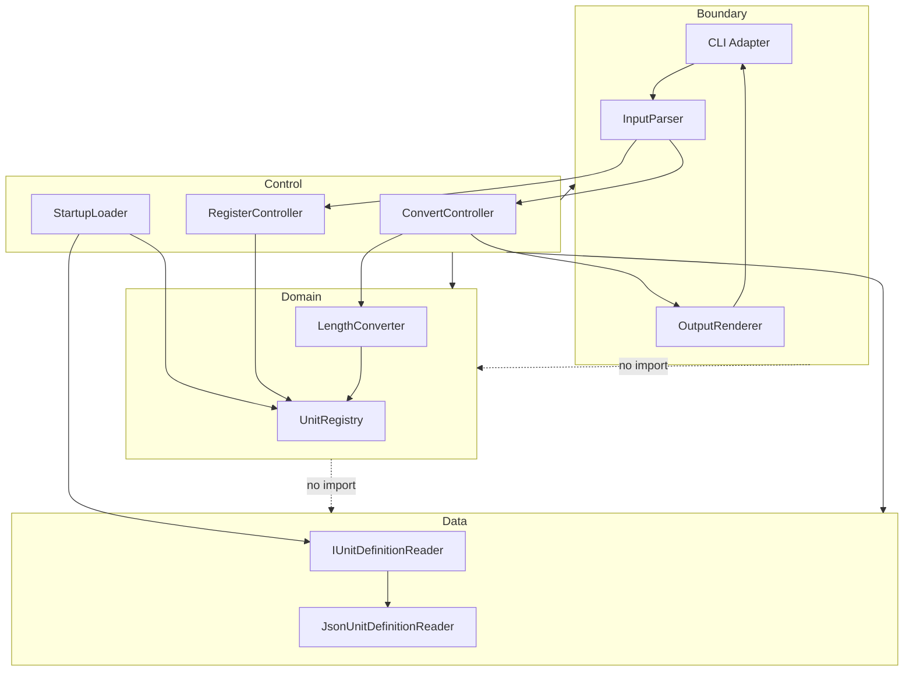

# Unit conversion problem definition
_Exported on 5/20/2026 at 20:49:25 GMT+9 from Cursor (3.4.20)_

---

**User**

당신은 문제 정의 전문가입니다.
워크스페이스: @c:\DEV\week2_day3\UnitConverter_07\ 
⚠️ 코드 작성·클래스 설계·알고리즘·빌드 스크립트는 하지 마십시오.

STEP 1 — Observation
1) 지금 우리가 해결하려는 "상황"을 한 문단으로 관찰 관점에서 서술하라.
2) 왜 길이(meter/feet/yard) 변환 문제를 다루는가?
3) OCP/SRP, 입력 검증, 설정 외부화, 동적 단위 등록, 출력 포맷과 연결해
   이 문제가 어떤 학습 맥락에서 등장하는가?

STEP 2 — Why #1: 정확한 변환 결과가 왜 중요한가?
STEP 3 — Why #2: 수동 계산이 아닌 프로그램(+테스트)인 이유?
STEP 4 — Why #3: 계약을 먼저 고정하려는 이유?

STEP 5 — 문제 정의
1) 표면 문제 1~2문장
2) 개선된 정의 3~7문장
3) 핵심 Invariant 5개 이내 (측정·검증 가능한 문장)
4) 훈련하려는 사고 능력 3개

출력: 구조화된 Markdown만. 코드·파일 경로 금지.


---

**Cursor**

워크스페이스 맥락을 파악한 뒤, 코드·경로 없이 문제 정의만 정리합니다.


# 길이 단위 변환기 — 문제 정의

---

## STEP 1 — Observation

### 1) 상황 관찰

학습자는 단일 진입점에 길이 변환 로직이 모여 있는 초기 프로그램을 출발점으로 삼는다. 사용자는 `단위:값` 형태로 한 번 입력하면, 그 값을 meter·feet·yard 등 지원 단위로 환산해 화면에 나열한다. 현재 구현은 동작은 하지만, 단위 추가 시 분기와 상수가 늘어나고, 비율이 코드에 박혀 있으며, 출력 형식·입력 검증·확장 요구(설정 파일, 동적 단위 등록, JSON/CSV 등)는 아직 반영되지 않았다. 실습은 약 6시간 안에 “동작하는 스크립트”를 “계약이 분명하고 테스트로 보호되는 소프트웨어”로 끌어올리는 과정이다.

### 2) 왜 길이(meter / feet / yard) 변환인가?

- **도메인이 단순하고 직관적**이라 변환 규칙(기준 단위, 비율)과 오류(역변환, 반올림)를 논의하기 쉽다.
- **실무와 연결**된다: 국제 단위(SI)와 영미 단위 혼용, 설정·로케일·API 응답 포맷 등은 현업에서도 자주 나온다.
- **확장 연습에 적합**하다: 단위 하나 추가, 비율 하나 변경, 출력 포맷 하나 추가만으로도 OCP·SRP·검증·외부 설정·동적 등록·포맷 분리가 자연스럽게 드러난다.

### 3) 학습 맥락에서의 연결

| 주제 | 이 문제에서의 역할 |
|------|-------------------|
| **OCP / SRP** | 단위·비율·입력 파싱·검증·변환·출력이 한곳에 섞이지 않게 나누고, 새 단위·새 포맷은 “기존 핵심 로직 수정 최소”로 넣는 연습 |
| **입력 검증** | 잘못된 형식·음수·미지 단위를 조기에 거절해, 잘못된 변환 결과가 “정상 출력”처럼 보이지 않게 함 |
| **설정 외부화** | 비율을 코드가 아닌 설정에서 읽어, 재배포 없이 규칙 변경·환경별 설정을 다루는 습관 |
| **동적 단위 등록** | 런타임에 `1 cubit = 0.4572 meter`처럼 등록해, 고정 enum이 아닌 **확장 가능한 단위 모델** 설계 |
| **출력 포맷** | 동일 변환 결과를 사람용(표)·기계용(JSON/CSV)으로보내 **표현 계층**과 **도메인 계층** 분리 |

6시간 Activities(분석 → 기본·품질 구현 → TC → 추가 요구 → 회고)는 “리팩토링 + 테스트 + AI 보조”를 한 사이클로 경험하도록 짜여 있다.

---

## STEP 2 — Why #1: 정확한 변환 결과가 왜 중요한가?

- **신뢰**: 한 번 틀린 숫자는 사용자·다운스트림 시스템 전체의 신뢰를 깨뜨린다. 단위 변환은 “보이지 않는 계산”이라 오류가 눈에 잘 안 띈다.
- **일관성**: meter를 허브로 feet↔yard를 계산할 때, 상수·역변환·반올림이 어긋나면 **서로 모순되는 쌍**이 나올 수 있다(예: A→B와 B→A가 맞지 않음).
- **비즈니스 규칙의 코드화**: `1 meter = 3.28084 feet` 같은 규칙은 요구사항의 일부이며, “대충 맞는 값”이 아니라 **명시된 정밀도와 규칙**을 지켜야 한다.
- **검증 가능성**: 정확성은 감으로 맞출 수 없고, 고정된 입력·기대 출력으로 **반복 검증**할 수 있어야 한다.

---

## STEP 3 — Why #2: 수동 계산이 아닌 프로그램(+테스트)인 이유?

- **반복·피로**: 매 입력마다 곱셈·나눗셈·반올림을 사람이 하면 실수와 시간 낭비가 누적된다.
- **변경 비용**: 단위·비율·포맷이 늘 때마다 수동 절차를 다시 배우고 적용할 수 없다. 프로그램은 **한 번의 규칙 변경**으로 모든 경로에 반영된다(설계가 맞다면).
- **회귀 방지**: 리팩토링·단위 추가·설정 로드 변경 후에도 **테스트가 이전에 맞던 케이스를 지킨다**는 안전망이 필요하다.
- **계약의 실행체**: “이 입력이면 이 출력”을 테스트로 고정하면, 팀·AI·미래의 자신이 같은 기준으로 맞출 수 있다.

---

## STEP 4 — Why #3: 계약을 먼저 고정하려는 이유?

- **모호함 제거**: “8.2 feet”처럼 보이는 출력이 반올림인지, 표시 자릿수 규칙인지, 아직 구현 전인지 팀마다 다르게 해석할 수 있다. 계약은 **허용 입력·거절 조건·기준 단위·출력 형식·정밀도**를 먼저 맞춘다.
- **설계 방향 결정**: 동적 등록·JSON 출력·설정 파일은 구현 디테일이 아니라 **행위 계약**이다. 계약이 없으면 클래스만 늘고 요구는 빠진다.
- **테스트·구현 순서**: 계약 → 테스트(또는 테스트 가능한 명세) → 구현 순이면, “일단 돌아가게” 만든 뒤 나중에 요구를 끼워 넣는 비용을 줄인다.
- **OCP/SRP의 기준**: “무엇이 바뀌어도 되는가(확장)”와 “무엇은 한 책임인가(분리)”는 계약(인터페이스·불변식) 없이는 판단이 흔들린다.

---

## STEP 5 — 문제 정의

### 1) 표면 문제 (1~2문장)

사용자가 `단위:값`으로 길이를 입력하면, 지원하는 모든 길이 단위로 변환한 결과를 출력하는 프로그램을 만든다. 단위·비율·출력 방식이 늘어나도 기존 핵심을 최소만 수정하고, 변환과 입력 검증은 테스트로 보장한다.

### 2) 개선된 정의 (3~7문장)

길이 변환 시스템은 **기준 단위(meter)를 중심으로 한 단위 그래프** 위에서, 등록된 각 단위의 meter 대비 비율로 임의 단위 간 환산을 수행한다. 사용자 입력은 정해진 형식과 유효한 단위·양수(또는 명시된 범위)만 허용하며, 위반 시 명확한 오류로 종료하거나 거절 메시지를 반환한다. 변환 비율은 코드 하드코딩이 아니라 **외부 설정**에서 읽고, 런타임에 `1 cubit = 0.4572 meter` 형태로 **동적 등록**할 수 있어야 한다. 동일한 변환 결과는 **표 / JSON / CSV** 등 선택한 포맷으로 일관되게보낸다. 구조는 단위 추가·포맷 추가·설정 변경 시 **기존 변환·검증 로직의 수정을 최소화(OCP)** 하고, 파싱·검증·변환·포맷·설정 로드는 **각각 하나의 책임(SRP)** 으로 분리한다. 모든 공개된 변환 규칙과 거절 조건은 **자동화된 테스트**로 검증 가능해야 한다.

### 3) 핵심 Invariant (5개 이내, 측정·검증 가능)

1. **기준 일관성**: 동일 입력에 대해, 어떤 경로로 변환하든 최종 meter 환산값은 동일하다(허브 단위 기준 단일 값).
2. **역변환 대칭**(등록 비율이 \(r\)일 때): `값`을 A→meter→B로 보낸 뒤 B→meter→A로 되돌리면, 허용 오차(예: 반올림 규칙에 따른 ε) 안에서 원래 `값`과 일치한다.
3. **거절 불변**: 형식 오류·미지 단위·검증 실패(예: 음수) 입력은 변환 결과를 출력하지 않고, 정의된 오류 응답만 반환한다.
4. **등록 후 가용성**: `1 cubit = 0.4572 meter` 등록 직후, cubit을 입력·출력 단위로 사용한 변환이 설정·등록 비율과 일치한다.
5. **포맷 동등성**: 동일 변환 결과에 대해 표·JSON·CSV는 **동일한 수치 집합**을 담으며, 포맷만 다르다(필드 누락·단위 누락 없음).

### 4) 훈련하려는 사고 능력 (3개)

1. **계약 우선 사고**: 구현 전에 입력·출력·오류·정밀도·확장점을 명세하고, 테스트로 계약을 고정하는 능력.
2. **변경에 강한 구조 설계**: 단위·비율·포맷·설정 소스가 늘 때 “어디를 고치지 않아도 되는가”를 OCP/SRP 관점에서 판단하는 능력.
3. **도메인 불변식 검증**: 변환 정확성·역변환·동적 등록·포맷 동등성을 **측정 가능한 문장**으로 쓰고 테스트로 지키는 능력.

---

*본 문서는 구현·설계·알고리즘 제안 없이, 관찰과 문제 정의만을 다룹니다.*

---

**User**

UnitConverter_07 프로젝트를 "고객 인터뷰" 관점에서 준비한다.
제품이 아니라 학습자/사용자의 행동을 드러내는 Mom Test 질문 10개.
각 질문: (1) 과거 구체 경험 (2) 실제 행동 (3) 돈/시간/리스크 연결.
금지: 기능 나열형 질문만으로 끝내기.
마지막에 "진짜 위험 가정" 3개를 bullet로.
구현·코드 금지.


---

**Cursor**

# UnitConverter_07 — Mom Test 인터뷰 질문 (학습자·사용자 관점)

**대상 가정:** 길이 단위를 실제로 맞춰야 했던 사람, 비슷한 실습/리팩토링을 겪은 개발 학습자, 팀에서 단위·설정·출력 규칙을 다뤄본 사람  
**목적:** “변환기 기능”이 아니라 **언제·왜·어떻게 행동했는지**를 드러내기

---

## 질문 10개

### 1. 마지막으로 길이 단위가 틀려서 문제가 된 때

> **지난 12개월 안에**, meter/feet/yard(또는 다른 길이 단위) 때문에 **실제로 잘못된 수치**가 나온 적이 있나요? 그때 **누가** 발견했고, **몇 번** 확인·수정했으며, 그 뒤 **어떤 절차**(엑셀, 계산기, 사내 도구 등)로 맞췄나요?

- (1) 과거 구체 경험 · (2) 발견·수정 행동 · (3) 재작업 시간·신뢰 리스크

---

### 2. “대충 맞는” 변환을 허용한 순간

> **최근에** 길이를 환산할 때 **소수 몇 자리까지** 맞춰야 한다고 **본인이 판단**한 사례가 있나요? 반대로 **“이 정도면 충분”** 하고 넘긴 사례는요? 그 기준을 **누구와** 맞췄고, 틀렸을 때 **무엇**(금액, 일정, 안전)이 걸렸나요?

- (1) 판단 기준이 있던 순간 · (2) 자릿수·검증 행동 · (3) 오차 허용 vs 실패 비용

---

### 3. 단위 표기·포맷 때문에 받은 피드백

> **CSV/JSON/표** 중 하나로 길이 데이터를 **넘긴 적**이 있나요? 받는 쪽에서 **“단위가 빠졌다” “표기가 다르다”** 고 한 **가장 최근** 사례를 말해 주세요. 그때 **몇 분·몇 시간**이 추가로 들었나요?

- (1) 포맷 불일치 사례 · (2) 재전송·수정 행동 · (3) 협업·납기 시간

---

### 4. 비율·상수를 바꿔야 했던 경험

> **배포 없이** 길이 환산 비율이나 상수를 바꿔야 했던 적이 있나요? 있다면 **설정 파일·DB·코드** 중 **실제로** 어디를 고쳤고, **누가 승인**했으며, 바꾼 뒤 **무엇을** 다시 돌려봤나요?

- (1) 비율 변경 사건 · (2) 수정·검증 경로 · (3) 배포·회귀 리스크

---

### 5. 새 단위를 “그때그때” 붙인 경험

> meter/feet/yard 말고 **cubit, inch** 같은 단위를 **업무 중에** 새로 써야 한 적이 있나요? 그때 **기존 도구·스프레드시트·코드**에 어떻게 **추가**했고, 추가 후 **첫 번째로 깨진 것**은 무엇이었나요?

- (1) 신규 단위 도입 · (2) 추가·테스트 행동 · (3) 누락·불일치 리스크

---

### 6. 입력 검증을 나중에 넣은 이유

> 사용자 입력(형식 오류, 음수, 없는 단위) 때문에 **잘못된 결과가 그대로 나간** 적이 있나요? 그다음 **검증을 넣거나 강화**했을 때, **어떤 입력 패턴**을 먼저 막았고, **그 전후**로 지원 문의·디버깅 시간이 어떻게 달랐나요?

- (1) 잘못된 출력이 나간 사건 · (2) 검증 추가 순서 · (3) 지원·디버깅 시간

---

### 7. 비슷한 실습·과제를 끝낸 방식

> **단위 변환·리팩토링·테스트 작성**이 들어간 과제나 실습을 **마지막으로** 했을 때, **총 몇 시간** 썼고 **어느 순간**에 시간이 가장 많이 새었나요? (분석 / 구현 / 테스트 / 회고 중 **실제로** 가장 긴 구간)

- (1) 최근 실습 타임라인 · (2) 시간 쓴 구간 · (3) 학습·일정 비용

---

### 8. 테스트를 “먼저” vs “나중에” 한 경험

> 변환 로직에 **테스트를 먼저** 쓴 적과 **구현 후에** 쓴 적 중, **각각 한 번씩**만 골라 주세요. 그때 **버그를 몇 개** 테스트가 잡았고, **리팩토링할 때** 테스트 없이 고친 부분이 있었다면 **무엇**이었나요?

- (1) 두 번의 구체적 시도 · (2) 테스트·리팩토링 순서 · (3) 회귀·재작업 리스크

---

### 9. AI·도구에 맡긴 뒤 직접 확인한 것

> 코딩 과제에서 **생성형 AI**나 자동 완성에 변환·리팩토링을 맡긴 적이 있나요? **그대로 믿었다가** 틀린 걸 **본인이** 잡은 **가장 최근** 사례에서, **무엇을** 어떻게 검증했고, 그 검증에 **몇 분**이 들었나요?

- (1) AI 산출물 신뢰 실패 사례 · (2) 직접 검증 행동 · (3) 잘못된 머지·제출 리스크

---

### 10. “한 파일에 다 넣기”를 유지하거나 깬 결정

> 변환·입력·출력이 **한곳**에 있을 때와 **나눴을 때**, **팀/본인**이 **실제로** 겪은 일(단위 추가, 요구 변경, 버그 수정)을 각각 **한 건**씩 말해 주세요. 나누기로 결정했다면 **누가** “이제는 나눠야 한다”고 말했고, **안 나누면** 어떤 일이 반복됐나요?

- (1) 구조 유지 vs 분리 사례 · (2) 변경·수정 패턴 · (3) 유지보수·인수인계 시간

---

## 진짜 위험 가정 (검증해야 할 것)

- **학습자는 “정확한 변환”보다 “과제 완료·빌드 통과”에 시간을 쓰고**, 테스트·설정 외부화·동적 등록은 마감 직전 스킵하거나 형식만 맞출 수 있다.
- **실무에서 단위 변환 오류의 비용을 본 적이 거의 없어**, 입력 검증·불변식·역변환 대칭은 “좋은 말”로만 남고 우선순위에서 밀린다.
- **AI가 만든 구조(OCP/SRP)를 이해하지 않은 채 제출**하면, 면접·코드리뷰·다음 요구(포맷·동적 단위)에서 **같은 파일에 if/else만 늘리는 패턴**으로 되돌아간다.

---

*기능 체크리스트(“JSON 지원할 건가요?”) 대신, 위 질문 답변으로 **행동·비용·실패 사례**를 먼저 수집한 뒤 요구를 좁히는 순서를 권장합니다.*

---

**User**

Dual-Track(UI/경계 vs Domain) + BCE 관점 설계 전문가로 행동하라.
대상: @c:\DEV\week2_day3\UnitConverter_07\ 
제약: 구현 코드 작성 금지. 설계·계약·테스트 목록·통합 계획만.

# 1) Entity(Domain) 설계
  1.1 개념 목록과 SRP
  1.2 Invariants
  1.3 유스케이스
  1.4 Domain API (시그니처 수준, 본문 X) + 실패 조건
  1.5 Domain 단위 테스트 설계 (RED 우선)

# 2) Boundary 설계
  2.1 시나리오: 입력→검증→실행→출력
  2.2 외부 계약: Input / Output / Error schema
  2.3 Boundary 계약 테스트 (Domain Mock 가정)
  2.4 에러 메시지 규칙 (문구 패턴 고정)

# 3) Data 설계
  3.1 목적
  3.2 인터페이스 계약 (이름만 제안)
  3.3 InMemory vs File(JSON/YAML) 비교 + 추천 1개와 이유
  3.4 Data 레이어 테스트

# 4) Integration & Verification
  4.1 의존성 방향 포함 흐름
  4.2 통합 테스트 시나리오 (정상 2+, 실패 3+)
  4.3 회귀 보호 규칙
  4.4 커버리지 목표 (Domain / Boundary / Data 수치)
  4.5 Traceability Matrix: Concept→Rule→UseCase→Contract→Test→Component

모호어 금지. 모든 규칙은 테스트로 검증 가능하게.


---

**Cursor**

요구사항을 재확인한 뒤 Dual-Track·BCE 기준으로 설계 문서만 작성합니다.


# UnitConverter_07 — Dual-Track + BCE 설계 명세

**아키텍처 원칙**
- **Entity(Domain)**: 길이·단위·변환 규칙만. I/O·포맷·파일·문자열 파싱 없음.
- **Control**: 유스케이스 오케스트레이션. Boundary↔Domain↔Data 연결만.
- **Boundary**: CLI 입력·출력·에러 표면화·표시 반올림.
- **Data**: 단위 정의·비율의 영속/로드. Domain 규칙 재구현 금지.

**기준 상수(비즈니스)**
- 허브: `meter`, 계수 `1.0`
- `1 meter = 3.28084 feet` → feet 계수 `3.28084`
- `1 meter = 1.09361 yard` → yard 계수 `1.09361`
- feet↔yard는 meter 경유만 허용(직접 비율 금지)

**표시 정밀도(경계 전용)**
- Domain: `double` 전체 정밀도 유지
- Boundary 표 형식: 소수 **1자리**, 반올림 규칙 `half-up` (예: `2.5 meter` → `8.2 feet`, `2.7 yard`)

---

# 1) Entity (Domain) 설계

## 1.1 개념 목록과 SRP

| 개념 | 책임(SRP) | 금지 |
|------|-----------|------|
| `UnitName` | 단위 식별자 불변값(비어 있지 않음, 공백 없음) | 비율·변환 계산 |
| `LengthQuantity` | `(UnitName, non-negative double)` 쌍의 유효성 | 다단위 일괄 출력 |
| `UnitRatio` | “1 단위 = X meter” 양수 계수 보관 | 파일·문자열 파싱 |
| `UnitRegistry` | 등록·조회·중복 거절·목록 | 변환 수식 실행 |
| `LengthConverter` | 허브(meter) 경유 환산 | 입력 형식 검증 |
| `RegisterUnitCommand` | 등록 요청 `(name, metersPerUnit)` 구조체 | 사용자 문장 파싱 |
| `ConversionSnapshot` | 단일 입력에 대한 `(targetUnit → meter환산값)` 집합 | JSON/CSV 직렬화 |

**OCP**: 새 단위 = `UnitRegistry`에 `UnitRatio` 추가만. `LengthConverter`·기존 단위 정의 수정 없음.  
**새 출력 포맷** = Boundary 추가만(Domain 무변경).

## 1.2 Invariants (측정 가능)

| ID | 불변식 | 검증 방법 |
|----|--------|-----------|
| D-INV-01 | 모든 등록 단위의 `metersPerUnit > 0` | 등록 API 거절 테스트 |
| D-INV-02 | `meter`는 항상 존재, `metersPerUnit == 1.0`, 삭제 불가 | 기본 시드·삭제 시도 테스트 |
| D-INV-03 | 동일 `UnitName` 중복 등록 불가 | 두 번째 등록 실패 테스트 |
| D-INV-04 | 환산: `targetValue = sourceValue * (source.metersPerUnit / target.metersPerUnit)` | 고정 입력·기대값 테이블 |
| D-INV-05 | 미등록 `UnitName`으로 `LengthConverter` 호출 시 실패, 스냅샷 없음 | unknown unit 테스트 |
| D-INV-06 | `LengthQuantity.value < 0` 이면 Domain 진입 전 거절(또는 Domain `RejectNegative`) | 음수 입력 테스트 |
| D-INV-07 | 등록 후 즉시 `Convert`에 신규 단위 포함 | 등록→변환 연속 테스트 |
| D-INV-08 | feet↔yard 결과는 meter 경유와 동일(직접 상수 사용 시 실패) | 삼각 일치 테스트 |

**허용 오차(테스트)**: `abs(actual - expected) <= 1e-9` (Domain 산술 비교).

## 1.3 유스케이스 (Domain 관점)

| ID | 유스케이스 | 선행조건 | 성공 결과 | 실패 |
|----|------------|----------|-----------|------|
| UC-D-01 | 길이 변환 | registry에 source 존재, value≥0 | 모든 등록 단위에 대한 `ConversionSnapshot` | unknown unit, negative value |
| UC-D-02 | 단위 등록 | name 유효, ratio>0, name 미중복 | registry에 추가 | duplicate, invalid ratio, empty name |
| UC-D-03 | 등록 단위 목록 | registry 비어 있지 않음 | `UnitName` 정렬 목록 | (선택) empty registry 정책 시 실패 |

**Control가 담당( Domain 밖 )**: `unit:value` 파싱, `1 cubit = 0.4572 meter` 문장 파싱, 파일 로드, 포맷 선택.

## 1.4 Domain API (시그니처만) + 실패 조건

```
// 값 객체
UnitName::create(std::string raw) -> Result<UnitName, DomainError>
LengthQuantity::create(UnitName unit, double value) -> Result<LengthQuantity, DomainError>

// 등록
UnitRegistry::seedDefaults() -> void   // meter, feet, yard
UnitRegistry::registerUnit(UnitName name, UnitRatio ratio) -> Result<void, DomainError>
UnitRegistry::contains(UnitName name) const -> bool
UnitRegistry::listUnits() const -> std::vector<UnitName>

// 변환
LengthConverter::convert(UnitRegistry const&, LengthQuantity input)
    -> Result<ConversionSnapshot, DomainError>

// 스냅샷 조회(테스트·Control용)
ConversionSnapshot::source() const -> LengthQuantity
ConversionSnapshot::valueIn(UnitName target, UnitRegistry const&) const
    -> Result<double, DomainError>
ConversionSnapshot::allTargets(UnitRegistry const&) const -> std::vector<std::pair<UnitName,double>>
```

**DomainError 열거(고정)**

| 코드 | 발생 조건 |
|------|-----------|
| `EMPTY_UNIT_NAME` | name 길이 0 또는 공백 포함 |
| `NEGATIVE_VALUE` | value < 0 |
| `UNKNOWN_UNIT` | registry에 name 없음 |
| `DUPLICATE_UNIT` | register 시 name 존재 |
| `NON_POSITIVE_RATIO` | metersPerUnit ≤ 0 |
| `HUB_UNIT_IMMUTABLE` | meter 삭제·비율 변경 시도 |

## 1.5 Domain 단위 테스트 설계 (RED 우선)

| Test ID | Given | When | Then |
|---------|-------|------|------|
| D-TC-01 | seedDefaults | convert(meter, 1.0) | feet≈3.28084, yard≈1.09361 (ε) |
| D-TC-02 | seedDefaults | convert(feet, 3.28084) | meter≈1.0 |
| D-TC-03 | seedDefaults | convert(yard, 1.09361) | meter≈1.0 |
| D-TC-04 | seedDefaults | convert(meter, 2.5) | feet≈8.2021, yard≈2.734025 (ε, Boundary 반올림 전) |
| D-TC-05 | seedDefaults | convert(unknown, 1) | UNKNOWN_UNIT |
| D-TC-06 | seedDefaults | convert(meter, -1) | NEGATIVE_VALUE |
| D-TC-07 | empty name register | | EMPTY_UNIT_NAME |
| D-TC-08 | register(cubit, 0.4572) | convert(cubit, 1) | meter≈0.4572 |
| D-TC-09 | cubit 등록됨 | register(cubit, …) again | DUPLICATE_UNIT |
| D-TC-10 | register(x, 0) | | NON_POSITIVE_RATIO |
| D-TC-11 | feet→yard via converter | | yard ≈ feet * (3.28084/1.09361) (ε) |
| D-TC-12 | 3 units registered | convert 후 allTargets size | 3 |

**RED 순서**: D-TC-01 → 05 → 06 → 08 → 09 (핵심 실패 먼저).

---

# 2) Boundary 설계

## 2.1 시나리오: 입력 → 검증 → 실행 → 출력

```
[stdin/argv]
    → InputParser (Boundary)
        → ParseResult { ConvertCommand | RegisterCommand | FormatOption }
    → RequestValidator (Boundary: 형식·숫자 파싱 실패)
    → Control.ConvertController / RegisterController
        → Domain (mock 가능)
        → ConversionSnapshot
    → OutputRenderer (Boundary: table | json | csv)
        → stdout
```

| 단계 | 책임 | 실패 시 |
|------|------|---------|
| 입력 수신 | 한 줄 또는 인자 수집 | (OS 수준, 테스트에서 문자열 주입) |
| 파싱 | `unit:value` / `1 name = ratio meter` / `--format=json` | `ERR_INVALID_FORMAT`, `ERR_INVALID_REGISTER_FORMAT` |
| 검증 | 숫자 변환, 빈 토큰 | `ERR_INVALID_NUMBER` |
| 실행 | Control→Domain | DomainError → Boundary 코드 매핑 |
| 출력 | 스냅샷 직렬화 | (성공만) |

## 2.2 외부 계약: Input / Output / Error schema

### Input (CLI 한 줄)

| 패턴 | 정규식(계약) | 의미 |
|------|--------------|------|
| 변환 | `^[a-zA-Z][a-zA-Z0-9_]*:[+-]?(\d+)(\.\d+)?$` | unit + non-negative decimal |
| 등록 | `^1\s+([a-zA-Z][a-zA-Z0-9_]*)\s*=\s*(\d+(\.\d+)?)\s+meter$` | 1 X = Y meter |
| 포맷 옵션 | `^--format=(table\|json\|csv)$` | 기본 `table` |

**대소문자**: unit 이름 **case-sensitive** (`Meter` ≠ `meter`).

### Output — Table (기본)

- 한 줄당: `{sourceValue} {sourceUnit} = {rounded} {targetUnit}`
- `rounded` = 소수 1자리 half-up
- 모든 `registry.listUnits()` 대상에 대해 출력( source 포함)

### Output — JSON

```json
{
  "source": { "unit": "meter", "value": 2.5 },
  "conversions": [
    { "unit": "meter", "value": 2.5 },
    { "unit": "feet", "value": 8.2 },
    { "unit": "yard", "value": 2.7 }
  ]
}
```

- `value` 숫자 타입, table과 **동일 반올림 규칙** 적용 후 기록

### Output — CSV

```
source_unit,source_value,target_unit,target_value
meter,2.5,meter,2.5
meter,2.5,feet,8.2
meter,2.5,yard,2.7
```

- 헤더 필수, 행 수 = 등록 단위 수

### Error (stderr, exit code)

| exit | code | schema |
|------|------|--------|
| 1 | `ERR_INVALID_FORMAT` | `Invalid format. Use unit:value (ex: meter:2.5)` |
| 1 | `ERR_INVALID_NUMBER` | `Invalid number: {token}` |
| 1 | `ERR_UNKNOWN_UNIT` | `Unknown unit: {unit}` |
| 1 | `ERR_NEGATIVE_VALUE` | `Value must be non-negative: {value}` |
| 1 | `ERR_INVALID_REGISTER_FORMAT` | `Invalid register format. Use 1 unit = ratio meter (ex: 1 cubit = 0.4572 meter)` |
| 1 | `ERR_DUPLICATE_UNIT` | `Unit already registered: {unit}` |
| 1 | `ERR_INVALID_RATIO` | `Ratio must be positive: {ratio}` |
| 2 | `ERR_CONFIG_LOAD` | `Failed to load config: {path}` |

**계약**: 메시지 문자열 **완전 일치**(공백·구두점 포함). 테스트는 golden string 비교.

## 2.3 Boundary 계약 테스트 (Domain Mock 가정)

| Test ID | Mock Domain 반환 | Boundary 검증 |
|---------|------------------|-----------------|
| B-TC-01 | convert 성공 스냅샷 고정 | table 라인 3줄, 순서·문자열 exact |
| B-TC-02 | 동일 스냅샷 | JSON 파싱 후 conversions 길이·값 |
| B-TC-03 | 동일 스냅샷 | CSV 헤더+행 수 |
| B-TC-04 | input `abc` | exit 1, ERR_INVALID_FORMAT |
| B-TC-05 | input `meter:abc` | ERR_INVALID_NUMBER |
| B-TC-06 | input `meter:-1` | ERR_NEGATIVE_VALUE (파서 또는 Domain 매핑) |
| B-TC-07 | Domain UNKNOWN_UNIT | ERR_UNKNOWN_UNIT |
| B-TC-08 | register `1 cubit = 0.4572 meter` | Control.register 호출 인자 (name, 0.4572) |
| B-TC-09 | register 잘못된 문장 | ERR_INVALID_REGISTER_FORMAT |
| B-TC-10 | `--format=json` + 성공 | stdout JSON only, stderr empty |

## 2.4 에러 메시지 규칙 (문구 패턴 고정)

1. 접두사: `Invalid`, `Unknown`, `Value must`, `Unit already`, `Ratio must`, `Failed to load` 중 하나.
2. Placeholder: `{token}`은 입력에서 추출한 **원문 부분문자열**, trim 없음.
3. 예시 괄호: `(ex: ...)`는 요구 메시지에만 사용, 1회.
4. stderr 단일 줄, 개행 1개, stdout 변환 결과 없음.
5. 성공 시 exit `0`, Domain/Boundary 비즈니스 거절 `1`, 설정 로드 실패 `2`.

---

# 3) Data 설계

## 3.1 목적

- 변환 비율의 **초기 시드**와 **재시작 후 복원**을 Domain 밖에서 공급.
- Domain `UnitRegistry`는 Data가 넘긴 `(name, metersPerUnit)` 목록만 **주입**받음.

## 3.2 인터페이스 계약 (이름만)

```
IUnitDefinitionReader::readAll() -> Result<std::vector<UnitDefinitionDto>, DataError>
IUnitDefinitionWriter::writeAll(std::vector<UnitDefinitionDto>) -> Result<void, DataError>
UnitDefinitionDto { string name; double metersPerUnit; }
```

- Control: 앱 시작 시 `readAll` → `registry.seedFrom(dtos)`; 종료 시 선택적 `writeAll`.
- **Domain은 인터페이스 모름** — DTO→`RegisterUnitCommand` 변환은 Control.

## 3.3 InMemory vs File(JSON/YAML)

| 기준 | InMemory | File (JSON/YAML) |
|------|----------|-------------------|
| 실습 6h 적합 | 즉시 GREEN | 파서·경로·스키마 테스트 추가 |
| OCP | 테스트 더블용 | 새 단위 배포 없이 비율 변경 |
| 실패 모드 | 없음 | 파일 없음·깨진 JSON·음수 ratio |
| 요구사항 충족 | 기본 요구만 | **설정 외부화** 명시 요구 |

**추천: File(JSON)**  
- 이유: README “설정 외부화” 필수, YAML 파서 의존 추가 불필요, 스키마 단순 고정 가능. InMemory는 **테스트 더블**로만 유지.

**JSON 스키마(계약)**

```json
{
  "hub": "meter",
  "units": [
    { "name": "meter", "metersPerUnit": 1.0 },
    { "name": "feet", "metersPerUnit": 3.28084 },
    { "name": "yard", "metersPerUnit": 1.09361 }
  ]
}
```

- 검증: `hub`는 `meter` 고정, `units`에 hub 1개, 모든 `metersPerUnit > 0`, `name` 유일.

## 3.4 Data 레이어 테스트

| Test ID | Given | Then |
|---------|-------|------|
| DT-TC-01 | 유효 JSON 파일 | 3 units, feet=3.28084 |
| DT-TC-02 | 파일 없음 | DataError FILE_NOT_FOUND → Boundary ERR_CONFIG_LOAD |
| DT-TC-03 | ratio 0 포함 JSON | DataError INVALID_DTO |
| DT-TC-04 | 중복 name JSON | DataError DUPLICATE_IN_FILE |
| DT-TC-05 | InMemory reader 시드 | readAll equals seed |
| DT-TC-06 | write 후 read | round-trip 동일 |

---

# 4) Integration & Verification

## 4.1 의존성 방향 포함 흐름



**규칙**
- Domain → Boundary/Data/Control 의존 금지.
- Data → Domain 의존 금지(DTO만).
- Boundary → Data 직접 접근 금지(Control 경유).

## 4.2 통합 테스트 시나리오

**정상 (≥2)**

| ID | 시나리오 | Then |
|----|----------|------|
| I-TC-01 | JSON 설정 로드 → stdin `meter:2.5` → table | exit 0, 3줄, feet=8.2 yard=2.7 |
| I-TC-02 | 동일 → `--format=json` | JSON conversions 3항, feet 8.2 |
| I-TC-03 | `1 cubit = 0.4572 meter` → `cubit:1` → csv | 4행(허브+신규), meter=0.5 반올림 규칙 적용값 |

**실패 (≥3)**

| ID | 시나리오 | Then |
|----|----------|------|
| I-TC-04 | `meter:abc` | exit 1, ERR_INVALID_NUMBER |
| I-TC-05 | `mile:1` (미등록) | exit 1, ERR_UNKNOWN_UNIT |
| I-TC-06 | 설정 파일 누락 | exit 2, ERR_CONFIG_LOAD |
| I-TC-07 | `meter:-2` | exit 1, ERR_NEGATIVE_VALUE |

## 4.3 회귀 보호 규칙

1. **D-TC-01~04** 실패 시 merge 금지(허브 변환 기준선).
2. **B-TC-01~03** golden 출력 문자열 변경 시 PR에 “표시 규칙 변경” 라벨 필수.
3. DomainError↔Boundary exit/message 매핑 테이블 변경 시 **B-TC-04~07** 동시 갱신.
4. JSON 설정 스키마 필드 추가는 **하위 호환**(기존 필드 유지) 또는 DT-TC 버전 명시.
5. 새 단위 추가 시 **기존 통합 I-TC 전체** 재실행(CI 필수).

## 4.4 커버리지 목표

| 레이어 | Line | Branch | 비고 |
|--------|------|--------|------|
| Domain | ≥95% | ≥90% | Converter, Registry, Quantity |
| Boundary | ≥90% | ≥85% | Parser 3패턴, Renderer 3종, error map |
| Data | ≥85% | ≥80% | JSON valid/invalid paths |
| Control | ≥80% | ≥75% | thin layer, 통합으로 보완 |

**제외 허용**: `main()`, 로깅-only 분기.

## 4.5 Traceability Matrix

| Concept | Rule (Invariant/Contract) | UseCase | Contract (API/Schema) | Test | Component |
|---------|----------------------------|---------|----------------------|------|-----------|
| UnitName | D-INV-03, non-empty | UC-D-02 | `UnitName::create` | D-TC-07 | Domain |
| UnitRatio | D-INV-01 | UC-D-02 | `metersPerUnit > 0` | D-TC-10 | Domain |
| Hub meter | D-INV-02 | UC-D-01 | seed + JSON hub | D-TC-01, DT-TC-01 | Domain, Data |
| LengthConverter | D-INV-04,08 | UC-D-01 | `LengthConverter::convert` | D-TC-01~04,11 | Domain |
| Negative guard | D-INV-06 | UC-D-01 | `NEGATIVE_VALUE` | D-TC-06, I-TC-07 | Domain, Boundary |
| Unknown unit | D-INV-05 | UC-D-01 | `ERR_UNKNOWN_UNIT` | D-TC-05, I-TC-05 | Domain, Boundary |
| Dynamic register | D-INV-07 | UC-D-02 | register CLI pattern | D-TC-08, B-TC-08, I-TC-03 | Domain, Boundary, Control |
| Table output | 반올림 1자리 | UC-D-01 | Table line schema | B-TC-01, I-TC-01 | Boundary |
| JSON output | 동일 수치 집합 | UC-D-01 | JSON schema | B-TC-02, I-TC-02 | Boundary |
| CSV output | header+rows | UC-D-01 | CSV schema | B-TC-03 | Boundary |
| Config load | hub+units | startup | JSON schema | DT-TC-01, I-TC-06 | Data, Control |
| Error surface | exit+exact msg | all | Error schema §2.2 | B-TC-04~07, I-TC-04~07 | Boundary |

---

## Dual-Track 실행 순서 (권장)

| 주차 | Track | 산출 |
|------|-------|------|
| 1 | Domain RED | D-TC-01,05,06 GREEN → Registry/Converter |
| 2 | Domain | D-TC-02~04,08~12 |
| 3 | Boundary + Mock | B-TC-01~07 (Domain stub) |
| 4 | Data | DT-TC-01~06 |
| 5 | Integration | I-TC-01~07, 회귀 규칙 CI 연결 |

---

*본 문서는 구현 본문 없음. 시그니처·스키마·테스트 ID는 구현 시 그대로 매핑할 것.*

---

**User**

Catch2를 가정하고 "구현 없이" RED 단계 테스트 케이스 제목 25~40개.
분류: 파싱 / 음수·0 / 미지원 단위 / 비율 정확도 / 동적 등록 / 출력 직렬화
(JSON/CSV/표 각 최소 3개씩)
각 테스트 옆에 보호하는 invariant 이름 한 줄.
코드 작성 금지.


---

**Cursor**

# Catch2 RED 단계 — 테스트 케이스 제목 (구현 없음)

**형식**: `TEST_CASE("제목", "[태그]")` — 본문·픽스처·코드 없음  
**상태**: 전부 RED 전제(실패가 정상)

---

## 파싱 (7)

| # | TEST_CASE 제목 | 보호 Invariant |
|---|----------------|----------------|
| P-01 | `"meter:2.5" parses to unit meter and value 2.5`, `[boundary][parse]` | **INPUT_CONTRACT_CONVERT** — 변환 입력 정규식 일치 시만 ConvertCommand 생성 |
| P-02 | `"meter:" without numeric token rejects with ERR_INVALID_NUMBER`, `[boundary][parse]` | **INPUT_CONTRACT_CONVERT** — 값 토큰 누락 시 변환 미실행 |
| P-03 | `":2.5" missing unit token rejects with ERR_INVALID_FORMAT`, `[boundary][parse]` | **INPUT_CONTRACT_CONVERT** — 단위 토큰 필수 |
| P-04 | `"meter2.5" missing colon rejects with ERR_INVALID_FORMAT`, `[boundary][parse]` | **INPUT_CONTRACT_CONVERT** — 구분자 `:` 필수 |
| P-05 | `"1 cubit = 0.4572 meter" parses to register name cubit ratio 0.4572`, `[boundary][parse]` | **INPUT_CONTRACT_REGISTER** — 등록 문장 패턴 일치 시 RegisterCommand 생성 |
| P-06 | `"1 cubit = meter" rejects with ERR_INVALID_REGISTER_FORMAT`, `[boundary][parse]` | **INPUT_CONTRACT_REGISTER** — ratio 숫자 없으면 등록 미실행 |
| P-07 | `"--format=json" selects JSON renderer for next successful convert`, `[boundary][parse]` | **FORMAT_OPTION_CONTRACT** — 허용 포맷만 table/json/csv |

---

## 음수·0 (5)

| # | TEST_CASE 제목 | 보호 Invariant |
|---|----------------|----------------|
| N-01 | `"meter:-1" rejects with ERR_NEGATIVE_VALUE and no stdout conversion`, `[boundary][negative]` | **D-INV-06 NON_NEGATIVE_VALUE** — 음수는 변환 결과 없음 |
| N-02 | `"feet:-0.01" rejects with ERR_NEGATIVE_VALUE`, `[boundary][negative]` | **D-INV-06 NON_NEGATIVE_VALUE** — 소수 음수 동일 거절 |
| N-03 | `LengthQuantity create with value -0.0 is rejected or treated per signed-zero policy`, `[domain][negative]` | **D-INV-06 NON_NEGATIVE_VALUE** — Domain 음수 진입 차단 |
| N-04 | `"meter:0" converts and all target values are exactly zero`, `[domain][zero]` | **ZERO_LENGTH_IDENTITY** — 0 입력 시 모든 단위 0 |
| N-05 | `"yard:0" table output still emits one line per registered unit with 0.0`, `[integration][zero]` | **ZERO_LENGTH_IDENTITY** — 0도 전 단위 스냅샷 포함 |

---

## 미지원 단위 (4)

| # | TEST_CASE 제목 | 보호 Invariant |
|---|----------------|----------------|
| U-01 | `"mile:1" after seedDefaults rejects with ERR_UNKNOWN_UNIT`, `[domain][unknown]` | **D-INV-05 KNOWN_UNIT_ONLY** — 미등록 단위 변환 불가 |
| U-02 | `convert with UnitName empty string fails EMPTY_UNIT_NAME`, `[domain][unknown]` | **EMPTY_UNIT_NAME** — 빈 식별자 거절 |
| U-03 | `"Meter:1" with case-sensitive registry rejects ERR_UNKNOWN_UNIT`, `[boundary][unknown]` | **UNIT_NAME_CASE_SENSITIVE** — 대소문자 불일치 = 미지원 |
| U-04 | `register then convert unknown sibling "cubits:1" rejects ERR_UNKNOWN_UNIT`, `[integration][unknown]` | **D-INV-05 KNOWN_UNIT_ONLY** — 오타 단위는 등록 여부와 무관 거절 |

---

## 비율 정확도 (6)

| # | TEST_CASE 제목 | 보호 Invariant |
|---|----------------|----------------|
| R-01 | `convert meter 1.0 to feet equals 3.28084 within epsilon 1e-9`, `[domain][ratio]` | **D-INV-04 HUB_CONVERSION_FORMULA** — feet = source × (srcM/targetM) |
| R-02 | `convert meter 1.0 to yard equals 1.09361 within epsilon 1e-9`, `[domain][ratio]` | **D-INV-04 HUB_CONVERSION_FORMULA** |
| R-03 | `convert feet 3.28084 to meter equals 1.0 within epsilon 1e-9`, `[domain][ratio]` | **D-INV-04 HUB_CONVERSION_FORMULA** — 역변환 대칭 |
| R-04 | `convert yard 1.09361 to meter equals 1.0 within epsilon 1e-9`, `[domain][ratio]` | **D-INV-04 HUB_CONVERSION_FORMULA** |
| R-05 | `convert meter 2.5 to feet equals 8.2021 before boundary rounding`, `[domain][ratio]` | **BUSINESS_RATIO_METER_FEET** — README 기준 상수 |
| R-06 | `feet to yard via converter matches meter hop not independent constant`, `[domain][ratio]` | **D-INV-08 METER_HOP_ONLY** — feet↔yard 직접 상수 금지 |

---

## 동적 등록 (5)

| # | TEST_CASE 제목 | 보호 Invariant |
|---|----------------|----------------|
| G-01 | `registerUnit cubit 0.4572 then convert cubit 1 yields meter 0.4572 within epsilon`, `[domain][register]` | **D-INV-07 REGISTER_THEN_CONVERT** — 등록 직후 변환 가능 |
| G-02 | `duplicate register cubit rejects DUPLICATE_UNIT`, `[domain][register]` | **D-INV-03 UNIQUE_UNIT_NAME** |
| G-03 | `registerUnit with metersPerUnit 0 rejects NON_POSITIVE_RATIO`, `[domain][register]` | **D-INV-01 POSITIVE_RATIO** |
| G-04 | `after register cubit convert meter 2.5 snapshot includes four targets`, `[integration][register]` | **D-INV-07 REGISTER_THEN_CONVERT** — 스냅샷에 신규 단위 포함 |
| G-05 | `meter hub ratio change attempt rejects HUB_UNIT_IMMUTABLE`, `[domain][register]` | **D-INV-02 HUB_METER_IMMUTABLE** |

---

## 출력 직렬화 — 표 Table (4)

| # | TEST_CASE 제목 | 보호 Invariant |
|---|----------------|----------------|
| T-01 | `table render meter 2.5 includes line "2.5 meter = 8.2 feet" exact string`, `[boundary][table]` | **TABLE_LINE_SCHEMA** — `{src} {unit} = {rounded} {target}` |
| T-02 | `table render meter 2.5 includes line "2.5 meter = 2.7 yard" exact string`, `[boundary][table]` | **DISPLAY_ROUND_HALF_UP_1DP** — 소수 1자리 half-up |
| T-03 | `table render emits exactly N lines for N registered units`, `[boundary][table]` | **TABLE_COMPLETE_TARGETS** — 누락 단위 없음 |
| T-04 | `table render includes source unit line meter to meter 2.5`, `[boundary][table]` | **TABLE_INCLUDES_SOURCE** — source도 target 집합에 포함 |

---

## 출력 직렬화 — JSON (4)

| # | TEST_CASE 제목 | 보호 Invariant |
|---|----------------|----------------|
| J-01 | `JSON output contains source unit meter value 2.5`, `[boundary][json]` | **JSON_SCHEMA_SOURCE** — `source.unit` / `source.value` |
| J-02 | `JSON conversions array length equals registered unit count`, `[boundary][json]` | **JSON_COMPLETE_TARGETS** — 배열 길이 = 등록 수 |
| J-03 | `JSON conversions entry feet value 8.2 matches table rounding rule`, `[boundary][json]` | **FORMAT_NUMERIC_PARITY** — JSON·표 동일 반올림 값 |
| J-04 | `JSON output parses as valid JSON object with conversions array only required keys`, `[boundary][json]` | **JSON_SCHEMA_KEYS** — 허용 키만 존재 |

---

## 출력 직렬화 — CSV (4)

| # | TEST_CASE 제목 | 보호 Invariant |
|---|----------------|----------------|
| C-01 | `CSV first line is exact header source_unit,source_value,target_unit,target_value`, `[boundary][csv]` | **CSV_HEADER_SCHEMA** — 헤더 고정 |
| C-02 | `CSV data row count equals registered unit count for meter 2.5 input`, `[boundary][csv]` | **CSV_ROW_COUNT** — 행 수 = 단위 수 |
| C-03 | `CSV row meter to feet shows 8.2 target_value`, `[boundary][csv]` | **FORMAT_NUMERIC_PARITY** — CSV·표 동일 반올림 |
| C-04 | `CSV every row repeats same source_unit and source_value`, `[boundary][csv]` | **CSV_SOURCE_REPEAT** — source 열 일관 |

---

## 요약

| 분류 | 개수 |
|------|------|
| 파싱 | 7 |
| 음수·0 | 5 |
| 미지원 단위 | 4 |
| 비율 정확도 | 6 |
| 동적 등록 | 5 |
| 표 (Table) | 4 |
| JSON | 4 |
| CSV | 4 |
| **합계** | **39** |

**RED 실행 순서(권장)**: R-01 → D-INV 계열(N-01, U-01) → P-01 → G-01 → T-01 / J-01 / C-01 → 나머지 직렬화·엣지.

**Catch2 태그 필터 예**: `[domain][ratio]`, `[boundary][json]`, `[integration][unknown]` — 레이어별 병렬 RED 가능.

---

**User**

@c:\DEV\week2_day3\UnitConverter_07\ .cursorrules YAML 뼈대.
최상위 키만, 값은 비움:
project, code_style, architecture, tdd_rules, testing, forbidden, file_structure, ai_behavior
각 키 앞에 80자 폭의 # 구분선 주석.
YAML만 출력. 설명 없음.


---

**Cursor**

```yaml
################################################################################
project:

################################################################################
code_style:

################################################################################
architecture:

################################################################################
tdd_rules:

################################################################################
testing:

################################################################################
forbidden:

################################################################################
file_structure:

################################################################################
ai_behavior:
```

---

**User**

위 .cursorrules의 tdd_rules 블록만 채워라.
C++ 단위 변환기 기준:
red_phase / green_phase / refactor_phase 각각에
description, rules(목록), must_not(목록)
YAML만 출력.


---

**Cursor**

```yaml
tdd_rules:
  red_phase:
    description: >
      Catch2 테스트를 먼저 작성하고 실패를 확인한 뒤,
      Domain(변환·등록·불변식)부터 최소 범위로 구현한다.
    rules:
      - 실패하는 테스트(D-TC, B-TC, DT-TC, I-TC ID)를 먼저 추가한다
      - Domain 테스트는 I/O·파일·stdout 없이 순수 로직만 검증한다
      - 허브 변환(meter/feet/yard), 음수 거절, 미지원 단위를 RED 우선 순서로 작성한다
      - Boundary 테스트는 Domain을 mock/stub하여 계약(에러 문구·exit code·포맷)만 검증한다
      - 하나의 RED 테스트당 하나의 실패 원인만 드러나게 한다
      - 비율 기대값은 README 상수(3.28084, 1.09361)와 epsilon 1e-9로 고정한다
    must_not:
      - 테스트 없이 프로덕션 코드를 먼저 작성하지 않는다
      - RED 단계에서 전체 통합·파일 로드·JSON 파서를 한꺼번에 구현하지 않는다
      - golden 출력·에러 메시지를 임의 문구로 작성하지 않는다(설계 계약과 불일치)
      - Domain에 cout, fstream, argv 파싱을 넣지 않는다
      - 실패 테스트를 @skip, DISABLED, 주석 처리로 숨기지 않는다

  green_phase:
    description: >
      현재 RED 테스트를 통과시키는 최소 코드만 작성하고,
      테스트 스위트 전체가 GREEN인지 확인한다.
    rules:
      - RED를 통과하는 가장 단순한 구현(하드코딩 포함)을 허용한다
      - Domain 먼저 GREEN → Boundary mock GREEN → Data → Integration 순으로 진행한다
      - DomainError와 Boundary exit/message 매핑을 설계 표와 동일하게 유지한다
      - 표·JSON·CSV는 동일 반올림(half-up, 소수 1자리) 규칙을 공유한다
      - 동적 등록 후 즉시 convert 스냅샷에 신규 단위가 포함되는지 테스트로 확인한다
      - 커밋 전 해당 레이어 태그 필터 테스트 전부 실행한다
    must_not:
      - GREEN을 위해 테스트 기대값·epsilon·메시지 문자열을 변경하지 않는다
      - 통과하지 않은 테스트를 삭제·완화하지 않는다
      - 여러 RED를 한 번에 풀기 위해 범위 밖 리팩토링·기능 추가를 하지 않는다
      - feet↔yard 직접 상수로 우회 구현하지 않는다(meter 허브만)
      - Boundary 없이 Domain에서 stdout으로 결과를 출력하지 않는다

  refactor_phase:
    description: >
      전체 테스트가 GREEN인 상태에서만 구조를 개선하고,
      OCP/SRP·BCE 경계를 강화하며 동작·계약은 불변으로 유지한다.
    rules:
      - 리팩토링 전후 동일 테스트 스위트를 실행하고 diff 없음을 확인한다
      - 중복 비율·분기를 UnitRegistry/LengthConverter로 추출한다
      - 새 단위·포맷 추가 시 기존 Domain 테스트 수정 없이 확장 가능한지 확인한다
      - Boundary·Data·Control·Domain 의존 방향을 유지한다(Domain은 외부 레이어 미참조)
      - golden 출력·에러 메시지 변경 시 설계 문서와 B-TC/I-TC를 동시 갱신한다
      - 테스트 이름·태그([domain][boundary][integration])를 유지한다
    must_not:
      - RED/GREEN 없이 대규모 구조 변경을 하지 않는다
      - 리팩토링 중 새 요구(포맷·등록·설정)를 동시에 추가하지 않는다
      - 공개 Domain API 시그니처를 테스트 갱신 없이 변경하지 않는다
      - 커버리지 목표(Domain≥95%, Boundary≥90%, Data≥85%) 미달을 무시하지 않는다
      - if-else 단위 분기를 새 단위마다 LengthConverter에 누적하지 않는다
```

---

**User**

완성한 .cursorrules 전체를 검토하라. 수정 제안 금지.
보고만:
1) YAML 문법 오류 가능성
2) 누락된 필수 섹션
3) tdd_rules vs forbidden 충돌
4) Cursor가 지키기 어려운 ai_behavior 규칙
bullet만.


---

**Cursor**

**1) YAML 문법 오류 가능성**
- 최상위 키 7개(`project`, `code_style`, `architecture`, `testing`, `forbidden`, `file_structure`, `ai_behavior`)가 값 없이 `key:`만 있어 null로 파싱됨 — 대부분 파서에서 유효
- `#` 80자 구분선은 주석으로 처리되어 구조에는 영향 없음
- `tdd_rules` 하위만 중첩·리스트·folded scalar(`>`) 사용 — 들여쓰기 2칸 기준으로 문법상 문제 없음
- `≥`, `↔`, `→` 등 비ASCII가 따옴표 없는 스칼라에 포함 — UTF-8 환경에서는 통상 허용, 엄격/레거시 파서에서는 드물게 이슈 가능
- 문서 루트 `---` / 명시적 `null`·`{}` 없음 — 필수는 아니나 “빈 섹션” 의미가 파서마다 다르게 해석될 여지는 있음

**2) 누락된 필수 섹션**
- 요청했던 8개 최상위 키는 모두 존재
- 내용이 채워진 것은 `tdd_rules`뿐이며, 나머지 7개는 키만 있고 규칙·값 없음
- `ai_behavior`는 키만 있고 항목 자체가 없음
- `testing`·`forbidden`·`architecture`·`file_structure`가 비어 있어, `tdd_rules`가 참조하는 Catch2 태그, 레이어 경계, 금지 사항, 디렉터리 규칙을 파일 단독으로는 재현 불가

**3) tdd_rules vs forbidden 충돌**
- `forbidden` 블록이 비어 있어 문면상 직접 충돌 항목 없음
- `tdd_rules.must_not`에만 금지 성격 규칙이 있고 `forbidden`에는 동일·상위 규칙이 없어, 역할 분리가 아직 성립하지 않음
- 이후 `forbidden`에 “하드코딩 금지”, “통합 한 번에 구현 금지” 등을 넣으면 `green_phase.rules`의 “하드코딩 허용”과 잠재 충돌 여지는 있으나, 현재 파일 상태에서는 발생하지 않음

**4) Cursor가 지키기 어려운 ai_behavior 규칙**
- `ai_behavior`가 비어 있어 해당 블록 기준으로 평가할 규칙 없음
- 다만 `tdd_rules` 안에 AI가 자동으로 보장하기 어려운 성격의 문장이 포함됨: “실패를 확인한 뒤”, “커밋 전 테스트 전부 실행”, “커버리지 목표 미달 무시 금지”, “설계 표·설계 문서·B-TC/I-TC와 동일” — 외부 문서·CI·커버리지 도구·실행 결과에 의존
- “RED/GREEN 없이 대규모 구조 변경 금지”처럼 단계 판단이 필요한 규칙은 세션마다 일관 적용이 어려움
- Catch2의 `@skip`/`DISABLED` 금지는 표현은 구체적이나, 실제 준수 여부는 생성 코드를 매번 검사해야 해서 자동 준수 검증이 약함

---

**User**

프로젝트 루트 .cursorrules에 넣을 완성 YAML.
C++ C++17 이상 가정.
code_style: clang-format, 네이밍·헤더/소스 분리 원칙
architecture: boundary/control/entity 정의 + 의존성 방향
testing: Catch2 고정, AAA, fixture 규칙, 커버리지 기준
forbidden: std::cout 디버그 남발 / 매직 넘버 하드코딩 / catch(...) 무분별 삼키기 / 헤더 내 구현 포함 / 전역 상태 남용 (C++ 특화 5개 이상)
  (각각 pattern / reason / alternative)
file_structure: boundary/ control/ entity/ tests/ 트리 주석
ai_behavior: 레이어 위반 금지, 테스트 먼저, 리팩터는 green 이후
설명 없이 YAML 전체만.


---

**Cursor**

```yaml
################################################################################
project:
  name: UnitConverter
  language: C++
  standard: C++17
  description: >
    길이 단위 변환 CLI. meter 허브 기준 환산, 동적 단위 등록,
    설정 외부화, table/json/csv 출력.
  build: g++
  test_framework: Catch2

################################################################################
code_style:
  formatter: clang-format
  standard: C++17
  naming:
    types: PascalCase
    functions: camelCase
    variables: camelCase
    constants: kPascalCase or constexpr inline
    files: PascalCase matching primary type
    namespaces: lower_snake or project prefix
  header_source_split:
    - 선언은 include/ 또는 모듈 루트 .h, 정의는 src/ .cpp
    - 헤더는 include guard 또는 #pragma once
    - 템플릿·constexpr 소량 예외 외 구현은 .cpp에 둔다
  includes:
    - 자기 헤더 → 표준 → 서드파티 → 프로젝트 순
    - 헤더에서 using namespace std 금지
  formatting:
    - 커밋 전 clang-format 적용
    - 줄 길이 100 권장, 들여쓰기 4 spaces

################################################################################
architecture:
  layers:
    entity:
      role: Domain. UnitRegistry, LengthConverter, UnitRatio, 불변식.
      depends_on: []
    control:
      role: Use case. ConvertController, RegisterController, StartupLoader.
      depends_on: [entity, data_adapters via interface]
    boundary:
      role: CLI 입출력, 파싱, 렌더(table/json/csv), 에러 표면화.
      depends_on: [control]
    data:
      role: 설정·단위 정의 로드(JSON). DTO만 entity에 주입.
      depends_on: []
  dependency_direction:
    - boundary → control → entity
    - control → data (interface)
    - entity → boundary | control | data 금지
    - data → entity 구현 의존 금지(DTO 변환은 control)
  hub_unit: meter
  extension:
    - 새 단위: registry 등록만, converter 분기 추가 금지
    - 새 출력: boundary renderer 추가, entity 무변경

################################################################################
tdd_rules:
  red_phase:
    description: >
      Catch2 테스트를 먼저 작성하고 실패를 확인한 뒤,
      Domain(변환·등록·불변식)부터 최소 범위로 구현한다.
    rules:
      - 실패하는 테스트(D-TC, B-TC, DT-TC, I-TC ID)를 먼저 추가한다
      - Domain 테스트는 I/O·파일·stdout 없이 순수 로직만 검증한다
      - 허브 변환(meter/feet/yard), 음수 거절, 미지원 단위를 RED 우선 순서로 작성한다
      - Boundary 테스트는 Domain을 mock/stub하여 계약(에러 문구·exit code·포맷)만 검증한다
      - 하나의 RED 테스트당 하나의 실패 원인만 드러나게 한다
      - 비율 기대값은 README 상수(3.28084, 1.09361)와 epsilon 1e-9로 고정한다
    must_not:
      - 테스트 없이 프로덕션 코드를 먼저 작성하지 않는다
      - RED 단계에서 전체 통합·파일 로드·JSON 파서를 한꺼번에 구현하지 않는다
      - golden 출력·에러 메시지를 임의 문구로 작성하지 않는다(설계 계약과 불일치)
      - Domain에 cout, fstream, argv 파싱을 넣지 않는다
      - 실패 테스트를 @skip, DISABLED, 주석 처리로 숨기지 않는다

  green_phase:
    description: >
      현재 RED 테스트를 통과시키는 최소 코드만 작성하고,
      테스트 스위트 전체가 GREEN인지 확인한다.
    rules:
      - RED를 통과하는 가장 단순한 구현(하드코딩 포함)을 허용한다
      - Domain 먼저 GREEN → Boundary mock GREEN → Data → Integration 순으로 진행한다
      - DomainError와 Boundary exit/message 매핑을 설계 표와 동일하게 유지한다
      - 표·JSON·CSV는 동일 반올림(half-up, 소수 1자리) 규칙을 공유한다
      - 동적 등록 후 즉시 convert 스냅샷에 신규 단위가 포함되는지 테스트로 확인한다
      - 커밋 전 해당 레이어 태그 필터 테스트 전부 실행한다
    must_not:
      - GREEN을 위해 테스트 기대값·epsilon·메시지 문자열을 변경하지 않는다
      - 통과하지 않은 테스트를 삭제·완화하지 않는다
      - 여러 RED를 한 번에 풀기 위해 범위 밖 리팩토링·기능 추가를 하지 않는다
      - feet↔yard 직접 상수로 우회 구현하지 않는다(meter 허브만)
      - Boundary 없이 Domain에서 stdout으로 결과를 출력하지 않는다

  refactor_phase:
    description: >
      전체 테스트가 GREEN인 상태에서만 구조를 개선하고,
      OCP/SRP·BCE 경계를 강화하며 동작·계약은 불변으로 유지한다.
    rules:
      - 리팩토링 전후 동일 테스트 스위트를 실행하고 diff 없음을 확인한다
      - 중복 비율·분기를 UnitRegistry/LengthConverter로 추출한다
      - 새 단위·포맷 추가 시 기존 Domain 테스트 수정 없이 확장 가능한지 확인한다
      - Boundary·Data·Control·Domain 의존 방향을 유지한다(Domain은 외부 레이어 미참조)
      - golden 출력·에러 메시지 변경 시 설계 문서와 B-TC/I-TC를 동시 갱신한다
      - 테스트 이름·태그([domain][boundary][integration])를 유지한다
    must_not:
      - RED/GREEN 없이 대규모 구조 변경을 하지 않는다
      - 리팩토링 중 새 요구(포맷·등록·설정)를 동시에 추가하지 않는다
      - 공개 Domain API 시그니처를 테스트 갱신 없이 변경하지 않는다
      - 커버리지 목표(Domain 95%, Boundary 90%, Data 85%) 미달을 무시하지 않는다
      - if-else 단위 분기를 새 단위마다 LengthConverter에 누적하지 않는다

################################################################################
testing:
  framework: Catch2
  pattern: AAA
  aaa:
    arrange: Given registry/입력/fixture 시드
    act: When convert/register/parse 호출
    assert: Then Result 또는 exact stderr/stdout golden
  fixtures:
    - entity 테스트: UnitRegistryFixture(seedDefaults)
    - boundary 테스트: MockLengthConverter 고정 스냅샷
    - integration: 임시 config JSON + stdin 문자열
  tags:
    - "[entity][ratio]", "[boundary][parse]", "[boundary][json]"
    - "[data][config]", "[integration]"
  coverage_targets:
    entity: { line: 95, branch: 90 }
    boundary: { line: 90, branch: 85 }
    data: { line: 85, branch: 80 }
    control: { line: 80, branch: 75 }
  epsilon: 1.0e-9
  golden:
    - 에러 메시지·table/json/csv 출력은 문자열 완전 일치
    - 반올림: half-up 소수 1자리(boundary 전용)

################################################################################
forbidden:
  - pattern: "std::cout / std::cerr 디버그 출력 다수 삽입"
    reason: Boundary 계약·golden 테스트 오염, stderr 혼선
    alternative: "Catch2 CAPTURE, 로거 인터페이스(테스트에서 mock)"

  - pattern: "변환 비율·epsilon을 숫자 리터럴로 산 scattered (3.28084 등)"
    reason: 단일 진실 원천 위반, 테스트·설정 불일치
    alternative: "UnitRatio 상수, config JSON, named constexpr kFeetPerMeter"

  - pattern: "catch (...) { } 또는 catch(...) without rethrow"
    reason: 실패 원인 은닉, DomainError 매핑 불가
    alternative: "catch (const std::exception& e), expected DomainError enum"

  - pattern: "비-trivial 함수 정의를 .h에 직접 작성(헤더 내 구현)"
    reason: ODR·컴파일 의존 증가, entity/boundary 경계 흐림
    alternative: ".h 선언 + .cpp 정의, inline은 5줄 이하 한정"

  - pattern: "namespace 전역 mutable registry / singleton 상태"
    reason: 테스트 격리 불가, 순서 의존 플레이키
    alternative: "UnitRegistry 인스턴스를 fixture·control에 주입"

  - pattern: "entity에서 #include <iostream> 또는 fstream"
    reason: BCE entity 순수성 위반
    alternative: "boundary adapter가 stream 소유, entity는 Result<T,E>만"

  - pattern: "feet-yard 직접 곱셈 상수로 환산"
    reason: meter 허브 불변식 D-INV-08 위반
    alternative: "metersPerUnit 비율로 hub 경유 변환"

################################################################################
file_structure:
  tree: |
    UnitConverter_07/
    ├── entity/                 # Domain: registry, converter, ratio, errors
    │   ├── UnitRegistry.h
    │   ├── UnitRegistry.cpp
    │   ├── LengthConverter.h
    │   └── LengthConverter.cpp
    ├── control/                # Use cases: convert, register, bootstrap
    │   ├── ConvertController.h
    │   └── RegisterController.cpp
    ├── boundary/               # CLI, parser, renderers, error map
    │   ├── CliApp.cpp
    │   ├── InputParser.cpp
    │   └── TableRenderer.cpp
    ├── data/                   # JSON config reader (optional phase)
    │   └── JsonUnitDefinitionReader.cpp
    ├── tests/
    │   ├── entity/             # [entity] Catch2
    │   ├── boundary/           # [boundary] mock entity
    │   ├── data/
    │   └── integration/        # end-to-end
    ├── config/
    │   └── units.json
    └── main.cpp                # wiring only, logic 금지

################################################################################
ai_behavior:
  layer_discipline:
    - entity에 I/O·파싱·포맷·파일 로드 금지
    - boundary가 entity/data를 직접 mutate 금지(control 경유)
    - main.cpp는 조립만
  workflow:
    - 항상 실패 테스트(RED) 먼저 제안·작성
    - GREEN은 현재 실패 테스트 통과에 필요한 최소 diff만
    - refactor는 전 테스트 GREEN 확인 후에만
  output:
    - 한 턴에 RED 1~3개 또는 GREEN 1개 범위 우선
    - 설계 계약과 다른 에러 문구·출력 생성 금지
  must_not:
    - 레이어 위반 코드를 편의상 한 파일에 몰아넣기
    - 테스트 삭제·완화로 GREEN 만들기
    - tdd_rules.green_phase 하드코딩 허용을 refactor 전 영구화
```

---

**User**

@c:\DEV\week2_day3\UnitConverter_07\ 위한 요구사항 서술 패키지. 구현·코드 금지.

Level 1 Epic
  제목: "확장 가능한 C++ 단위 변환 학습 시스템"
  목적 4줄, 성공 기준 측정 가능하게 (커버리지, 계약 테스트, 회귀 정책)

Level 2 User Journey (1개 정본)
  Persona: C++/클린 아키텍처 학습자
  단계 5~7: 문제 인식→계약 정의→도메인 분리→Dual-Track TDD→회귀 보호
  각 단계 Pain / Opportunity 1줄

Level 3 User Stories (최소 6개)
  입력 검증 / 레지스트리·OCP / 환산 정확도 / 출력 포맷 / 설정 로드 실패 / 동적 단위 등록
  각 Story에 Acceptance Criteria는 체크 가능한 bullet

Level 4 Gherkin Feature 1개
  Background: README meter↔feet↔yard 비율을 Given으로 고정
  Scenario: happy path meter 입력
  Scenario: 잘못된 형식
  Scenario: unknown unit
  Scenario: 설정 파일 형식 오류

Level 5 체크리스트
  이 저장소 범위 항목만
  Epic→Journey→Story→Gherkin 정합성 체크박스 표

Markdown 표와 체크리스트 적극 사용.


---

**Cursor**

# UnitConverter_07 — 요구사항 서술 패키지

---

## Level 1 — Epic

| 항목 | 내용 |
|------|------|
| **제목** | 확장 가능한 C++ 단위 변환 학습 시스템 |
| **목적 (4줄)** | ① 단일 파일·분기 나열에서 **entity / control / boundary** 로 책임을 분리해 C++ 클린 아키텍처를 체득한다.<br>② **Catch2 + Dual-Track TDD**(Domain RED → Boundary 계약 → 통합)로 “테스트가 설계를 고정한다”는 경험을 만든다.<br>③ meter 허브 기반 길이 환산·동적 단위 등록·설정 외부화·다중 출력 포맷을 **OCP/SRP** 로 확장한다.<br>④ 6시간 실습 안에 **회귀 가능한 산출물**(테스트 스위트, golden 계약, 커버리지)을 남긴다. |
| **범위** | 길이 단위 CLI 변환기, C++17+, Catch2, JSON 설정, table/json/csv 출력 |

### 성공 기준 (측정 가능)

| ID | 기준 | 측정 방법 | 통과 임계값 |
|----|------|-----------|-------------|
| SC-01 | Domain 환산·등록 불변식 | `[entity]` Catch2 + line/branch 커버리지 | line ≥ 95%, branch ≥ 90% |
| SC-02 | Boundary 입출력·에러 계약 | golden stderr/stdout 문자열 완전 일치 테스트 | line ≥ 90%, branch ≥ 85% |
| SC-03 | Data 설정 로드 | valid/invalid JSON 시나리오 테스트 | line ≥ 85%, branch ≥ 80% |
| SC-04 | 계약 테스트 존재 | B-TC(파싱·포맷·에러)·I-TC(통합) 실행 | 정의된 시나리오 100% PASS |
| SC-05 | 허브 변환 정확도 | meter↔feet↔yard, ε = 1e-9 | D-TC 비율 테이블 전부 PASS |
| SC-06 | 표시 일관성 | table/json/csv 동일 반올림(half-up, 1자리) | 2.5 meter → 8.2 feet, 2.7 yard |
| SC-07 | 회귀 정책 | merge 전 전체 스위트 + 기준선 테스트 | D-TC-01~04 실패 시 merge 금지; golden 변경 시 라벨·TC 동시 갱신 |

---

## Level 2 — User Journey (정본 1개)

**Persona:** C++ / 클린 아키텍처 학습자 — 단위 테스트·레이어 분리를 들어봤으나, 실습 코드는 한 파일에 `if (unit == …)` 가 쌓인 경험이 있음.

| 단계 | 활동 | Pain (1줄) | Opportunity (1줄) |
|------|------|------------|-------------------|
| **1. 문제 인식** | 레거시 단일 파일 실행, meter:2.5 입력, 출력·상수·분기 위치 파악 | 비율·단위·출력이 한곳에 있어 수정 시 연쇄 버그가 난다 | “무엇이 변환 규칙이고 무엇이 UI인가”를 분리할 경계가 보인다 |
| **2. 계약 정의** | 입력 형식, 에러 문구, exit code, table/json/csv 스키마, ε·반올림 규칙 문서화 | 요구가 말로만 있으면 AI·본인 구현이 매번 달라진다 | golden 테스트로 **허용 행위가 고정**된다 |
| **3. 도메인 분리** | entity에 Registry·Converter만 두고 I/O 제거 | Domain에 cout/파싱이 섞이면 테스트가 느리고 불안정해진다 | 순수 Domain 테스트로 **환산 불변식**을 먼저 지킨다 |
| **4. Dual-Track TDD — RED** | Catch2 실패 테스트: 비율, 음수, unknown, 파싱, 포맷 | 테스트 없이 구현하면 “돌아가지만 틀린” 상태가 된다 | RED가 **다음에 쓸 최소 코드 범위**를 알려준다 |
| **5. Dual-Track TDD — GREEN** | Domain → Boundary(mock) → Data → Integration 순 최소 구현 | 한 번에 통합·JSON·등록을 넣으면 실패 원인 추적이 불가능하다 | 레이어별 GREEN으로 **의존 방향**이 검증된다 |
| **6. Dual-Track TDD — REFACTOR** | 분기 제거, registry 주입, renderer 분리 | 조기 추상화는 과제 시간을 잡아먹는다 | 전 테스트 GREEN 후 구조 개선으로 **OCP 체감** |
| **7. 회귀 보호** | 커버리지 확인, 기준선·golden·태그 CI, 회고 | 리팩터 한 번에 출력 문구가 바뀌어도 nobody notices | 회귀 정책 + Traceability로 **다음 주차도 안전** |


---

## Level 3 — User Stories

### US-01 — 입력 검증

**As a** 학습자  
**I want** `단위:값` 입력이 잘못되면 변환 없이 명확한 오류를 받고  
**So that** 잘못된 결과가 정상 출력처럼 보이지 않는다.

| Acceptance Criteria |
|---------------------|
| [ ] `meter:2.5` 형식만 ConvertCommand로 진행한다 |
| [ ] `:` 없음, 단위 없음, 숫자 없음 → exit 1, `ERR_INVALID_FORMAT` 또는 `ERR_INVALID_NUMBER` |
| [ ] `meter:-1`, `feet:-0.01` → exit 1, `ERR_NEGATIVE_VALUE`, stdout에 변환 결과 없음 |
| [ ] 에러 메시지는 설계 계약 문자열과 **완전 일치** |
| [ ] `[boundary][parse]` 테스트 ≥ 3개 PASS |

---

### US-02 — 레지스트리·OCP

**As a** 학습자  
**I want** 단위 정의를 레지스트리에 등록하고 변환기는 분기 없이 동작하게 하고  
**So that** 새 단위 추가 시 `LengthConverter` 수정이 필요 없다.

| Acceptance Criteria |
|---------------------|
| [ ] seed 후 meter, feet, yard가 registry에 존재한다 |
| [ ] `LengthConverter`에 `if (unit == "feet")` 류 단위별 분기가 없다 |
| [ ] 신규 단위는 `registerUnit` API로만 추가한다 |
| [ ] 중복 이름 등록 → `DUPLICATE_UNIT`, 스냅샷 변화 없음 |
| [ ] `[entity]` registry 테스트 PASS |

---

### US-03 — 환산 정확도

**As a** 학습자  
**I want** meter 허브 기준으로 feet·yard 환산이 README 비율과 일치하고  
**So that** feet↔yard 직접 상수 우회 없이도 일관된 결과를 얻는다.

| Acceptance Criteria |
|---------------------|
| [ ] 1 meter → 3.28084 feet (ε ≤ 1e-9) |
| [ ] 1 meter → 1.09361 yard (ε ≤ 1e-9) |
| [ ] 3.28084 feet → 1 meter (역변환, ε ≤ 1e-9) |
| [ ] feet→yard 결과 = meter 경유 결과 (D-INV-08) |
| [ ] `2.5 meter` Domain 값: feet ≈ 8.2021 (반올림 전) |
| [ ] SC-05, SC-06 관련 `[entity][ratio]` 전부 PASS |

---

### US-04 — 출력 포맷

**As a** 학습자  
**I want** 동일 변환 결과를 table / json / csv 로 선택 출력하고  
**So that** 표현 계층이 Domain과 분리된다.

| Acceptance Criteria |
|---------------------|
| [ ] 기본 table: `2.5 meter = 8.2 feet`, `2.5 meter = 2.7 yard` (exact) |
| [ ] `--format=json` → 유효 JSON, `conversions` 길이 = 등록 단위 수 |
| [ ] csv 헤더: `source_unit,source_value,target_unit,target_value` |
| [ ] 세 포맷의 수치는 동일 반올림(half-up, 1자리) |
| [ ] table/json/csv 각 `[boundary]` golden 테스트 ≥ 3 PASS |

---

### US-05 — 설정 로드 실패

**As a** 학습자  
**I want** JSON 설정이 없거나 깨졌을 때 시작 단계에서 실패하고  
**So that** 잘못된 비율로 조용히 변환하지 않는다.

| Acceptance Criteria |
|---------------------|
| [ ] 유효 `units.json` 로드 시 meter/feet/yard 비율이 README와 일치 |
| [ ] 파일 없음 → exit 2, `Failed to load config: {path}` |
| [ ] ratio ≤ 0 또는 name 중복 JSON → 로드 실패, 변환 미시작 |
| [ ] `[data][config]` + `[integration]` 실패 시나리오 ≥ 2 PASS |
| [ ] Data line coverage ≥ 85% |

---

### US-06 — 동적 단위 등록

**As a** 학습자  
**I want** `1 cubit = 0.4572 meter` 입력으로 단위를 등록한 뒤 즉시 변환에 쓰고  
**So that** 재컴파일 없이 단위 공간을 확장할 수 있다.

| Acceptance Criteria |
|---------------------|
| [ ] 등록 문장 파싱 성공 → registry에 cubit, metersPerUnit=0.4572 |
| [ ] 등록 직후 `cubit:1` → meter ≈ 0.4572 (ε ≤ 1e-9) |
| [ ] 등록 후 `meter:2.5` 스냅샷에 cubit 포함(단위 수 +1) |
| [ ] 잘못된 등록 문장 → `ERR_INVALID_REGISTER_FORMAT`, exit 1 |
| [ ] `[domain][register]` + 통합 시나리오 PASS |

---

## Level 4 — Gherkin Feature

```gherkin
Feature: Length unit conversion CLI
  As a C++ clean architecture learner
  I want to convert and register length units via CLI
  So that conversion rules stay testable and extensible

  Background:
    Given the hub unit is "meter" with metersPerUnit 1.0
    And the registry contains unit "feet" with metersPerUnit 3.28084
    And the registry contains unit "yard" with metersPerUnit 1.09361
    And display rounding is half-up to 1 decimal place

  @integration @happy
  Scenario: Happy path — convert meter input to all units
    When the user runs the application with input "meter:2.5" and format "table"
    Then the exit code is 0
    And stdout contains "2.5 meter = 2.5 meter"
    And stdout contains "2.5 meter = 8.2 feet"
    And stdout contains "2.5 meter = 2.7 yard"
    And stderr is empty

  @boundary @parse
  Scenario: Invalid convert format — missing colon
    When the user runs the application with input "meter2.5"
    Then the exit code is 1
    And stderr is exactly "Invalid format. Use unit:value (ex: meter:2.5)"
    And stdout has no conversion lines

  @domain @unknown
  Scenario: Unknown unit — not in registry
    When the user runs the application with input "mile:1"
    Then the exit code is 1
    And stderr is exactly "Unknown unit: mile"
    And stdout has no conversion lines

  @data @config @failure
  Scenario: Config file format error — invalid ratio
    Given a config file where unit "feet" has metersPerUnit 0
    When the application starts with that config path
    Then the exit code is 2
    And stderr contains "Failed to load config:"
    And no convert command produces output
```

---

## Level 5 — 정합성 체크리스트 (저장소 범위)

### Epic ↔ Journey

| # | 체크 항목 | Epic | Journey 단계 |
|---|-----------|------|----------------|
| EJ-1 | Epic 목적 ① 레이어 분리 | SC-01~03 | 3 도메인 분리 |
| EJ-2 | Epic 목적 ② Dual-Track TDD | SC-04 | 4~6 RED/GREEN/REFACTOR |
| EJ-3 | Epic 목적 ③ 확장(등록·설정·포맷) | SC-06 | 5 GREEN, 6 REFACTOR |
| EJ-4 | Epic 목적 ④ 회귀 산출물 | SC-07 | 7 회귀 보호 |
| EJ-5 | 성공 기준 커버리지 수치가 testing 섹션과 동일 | SC-01~03 | 7 |

### Journey ↔ User Stories

| # | 체크 항목 | Journey | Story |
|---|-----------|---------|-------|
| JS-1 | 계약 정의 | 2 | US-01, US-04 (golden) |
| JS-2 | 도메인 분리 | 3 | US-02, US-03 |
| JS-3 | RED | 4 | US-01~03 실패 테스트 선행 |
| JS-4 | GREEN 순서 | 5 | US-02→03→04→05→06 |
| JS-5 | REFACTOR OCP | 6 | US-02 (분기 제거) |
| JS-6 | 회귀 | 7 | 전 Story AC + SC-07 |

### User Stories ↔ Gherkin

| # | 체크 항목 | Story | Gherkin Scenario |
|---|-----------|-------|------------------|
| SG-1 | 입력 검증 | US-01 | Invalid convert format |
| SG-2 | 환산 정확도 | US-03 | Background 비율 + Happy path 출력 |
| SG-3 | unknown unit | US-01 (미지 단위) | Unknown unit |
| SG-4 | 출력 포맷 | US-04 | Happy path table (+ json/csv AC 별도 TC) |
| SG-5 | 설정 실패 | US-05 | Config file format error |
| SG-6 | 동적 등록 | US-06 | (Feature 확장 시 별도 Scenario; AC는 Story에 정의됨) |

### Story ↔ 성공 기준 (Epic)

| Story | SC-01 | SC-02 | SC-03 | SC-04 | SC-05 | SC-06 | SC-07 |
|-------|:-----:|:-----:|:-----:|:-----:|:-----:|:-----:|:-----:|
| US-01 | | ✓ | | ✓ | | | ✓ |
| US-02 | ✓ | | | ✓ | | | ✓ |
| US-03 | ✓ | | | ✓ | ✓ | ✓ | ✓ |
| US-04 | | ✓ | | ✓ | | ✓ | ✓ |
| US-05 | | | ✓ | ✓ | | | ✓ |
| US-06 | ✓ | ✓ | | ✓ | ✓ | | ✓ |

### 저장소 범위 포함 여부

| # | 항목 | README/실습 범위 | 패키지 반영 |
|---|------|------------------|-------------|
| R-1 | meter/feet/yard 기본 변환 | ✓ | Background, US-03, Happy path |
| R-2 | OCP/SRP·입력 검증 | ✓ | US-01, US-02 |
| R-3 | Catch2·TDD·커버리지 | ✓ | Epic SC, Journey 4~7 |
| R-4 | 설정 외부화 JSON | ✓ | US-05, Config Scenario |
| R-5 | 동적 등록 cubit 예시 | ✓ | US-06 |
| R-6 | table/json/csv 출력 | ✓ | US-04 |
| R-7 | 6시간 Activities 회고 | ✓ | Journey 7 (회고는 AC 외 학습 산출) |
| R-8 | BCE boundary/control/entity | ✓ | Epic, Journey 3, US-02 |

### 최종 게이트 (릴리스 전)

- [ ] **G-1** Epic SC-01 ~ SC-07 전부 측정·기록됨  
- [ ] **G-2** User Journey 7단계 각각 대응 Story·테스트 존재  
- [ ] **G-3** User Story 6개 AC 체크박스 100% PASS  
- [ ] **G-4** Gherkin Feature 4 Scenario 자동화(또는 동등 I-TC) PASS  
- [ ] **G-5** EJ / JS / SG / R 표에서 ✗ 없음  
- [ ] **G-6** `.cursorrules` tdd_rules·forbidden·architecture와 Story 용어 일치(entity/boundary, meter 허브, golden)  

---

*본 패키지는 구현·코드·파일 경로를 포함하지 않으며, README 비즈니스 규칙·BCE 설계·`.cursorrules` 성공 기준과 정합되도록 작성됨.*

---

**User**

@c:\DEV\week2_day3\UnitConverter_07\ 사용자 여정을 스토리보드 형식으로.
Stage: Awareness / Entry / Action / Validation / Outcome
각 Stage마다 Action, Thinking, Emotion, Pain, Opportunity 1줄 이상.
목표: 알고리즘이 아닌 계약·테스트·레이어 분리 학습임을 명시.
코드 금지.


---

**Cursor**

# UnitConverter_07 — 사용자 여정 스토리보드

**Persona:** C++·클린 아키텍처 학습자 (단위 테스트는 들어봤지만, 실습은 한 파일에 변환 로직이 몰려 있음)  
**학습 목표(명시):** 환산 **알고리즘** 숙달이 아니라 **계약 고정 → 테스트로 보호 → entity/control/boundary 분리** 를 몸으로 익히는 것

---

## Stage 1 — Awareness (문제 인식)

| 프레임 | 내용 |
|--------|------|
| **Action** | 과제 README와 기존 단일 진입점 프로그램을 실행해 `meter:2.5` 입력 후, 출력·상수·분기·에러 처리가 **한 흐름**에 묶여 있음을 적어 본다. |
| **Thinking** | “곱셈 공식을 외우는 게 아니라, **어디까지가 규칙(도메인)** 이고 **어디부터가 화면/입력(경계)** 인지” 구분이 먼저다. |
| **Emotion** | 코드가 짧아서 안심되다가, “단위 하나만 더하면 if가 늘겠다”는 예감으로 불안해진다. |
| **Pain** | 비율·파싱·출력이 한곳에 있어 **수정 범위를 예측할 수 없고**, 틀린 출력이 **정상처럼** 보일 수 있다. |
| **Opportunity** | “변환기 과제”를 **계약·테스트·레이어** 학습 과제로 재정의할 수 있는 순간이다. |

**이 단계에서 배우는 것:** 문제 = 계산식이 아니라 **책임이 섞인 구조**다.

---

## Stage 2 — Entry (계약·여정 진입)

| 프레임 | 내용 |
|--------|------|
| **Action** | 입력 형식, exit code, 에러 문구, table/json/csv 출력 예시, ε·반올림 규칙을 **체크 가능한 문장**으로 정리하고 RED 테스트 제목을 적는다. |
| **Thinking** | “구현 전에 **허용/거절 행위**가 고정되어야 AI와 내가 같은 결과를 낸다.” |
| **Emotion** | 귀찮지만, golden 문자열을 적어 두니 “이제 논쟁이 줄겠다”는 안도감이 든다. |
| **Pain** | 요구가 말로만 있으면 매 시도마다 출력·메시지가 달라져 **회귀를 알 수 없다.** |
| **Opportunity** | **계약 = 테스트의 기대값** 이라는 Dual-Track 진입점이 생긴다. |

**이 단계에서 배우는 것:** 설계의 첫 산출물은 코드가 아니라 **계약**이다.

---

## Stage 3 — Action (레이어 분리·RED)

| 프레임 | 내용 |
|--------|------|
| **Action** | entity에 Registry·Converter만 두고, Catch2 **실패 테스트**부터 작성한다(허브 환산, 음수 거절, unknown unit). Boundary는 mock으로 파싱·에러만 RED한다. |
| **Thinking** | “지금은 빨리 돌리는 게 아니라, **실패가 하나의 이유만** 드러나게 쪼갠다.” |
| **Emotion** | 테스트가 빨갛게 실패할 때 오히려 “방향이 맞다”는 확신이 생긴다. |
| **Pain** | Domain에 입출력을 넣고 싶은 충동, 한 파일에 다 넣으면 당장은 쉬워 보인다. |
| **Opportunity** | **entity 순수 테스트**로 변환 규칙을 알고리즘 없이 **불변식(ε, 허브)** 로만 검증할 수 있다. |

**이 단계에서 배우는 것:** 행동 = 코딩이 아니라 **실패하는 테스트 추가 + 레이어 밀어내기**다.

---

## Stage 4 — Validation (GREEN·계약 검증)

| 프레임 | 내용 |
|--------|------|
| **Action** | Domain 최소 구현으로 `[entity]` GREEN → Boundary golden(stderr/stdout) GREEN → 설정 로드·통합 시나리오 순으로 통과시킨다. |
| **Thinking** | “통과는 편의가 아니라 **계약과 1:1** 인가? 하드코딩은 GREEN만 허용, 영구화는 금지.” |
| **Emotion** | 전 스위트가 초록일 때 성취감, golden 한 글자 차이로 실패할 때 “계약이 살아 있다”는 인상을 받는다. |
| **Pain** | GREEN을 위해 테스트·메시지를 바꾸고 싶은 유혹, 통합을 먼저 붙이면 실패 원인이 흐려진다. |
| **Opportunity** | **Validation = 사용자 시연**이 아니라 **자동 계약 테스트 + 커버리지 수치**로 증명할 수 있다. |

**이 단계에서 배우는 것:** “돌아간다”가 아니라 **계약·테스트가 동시에 만족**해야 완료다.

---

## Stage 5 — Outcome (REFACTOR·회귀·성과)

| 프레임 | 내용 |
|--------|------|
| **Action** | 전 테스트 GREEN 상태에서 분기·중복 비율을 Registry/Converter로 정리하고, cubit 동적 등록·json/csv 포맷을 **기존 Domain 테스트 수정 없이** 붙인 뒤 회귀 스위트·커버리지를 확인한다. |
| **Thinking** | “새 단위는 if가 아니라 **등록**이다. 새 포맷은 entity가 아니라 **boundary renderer**다.” |
| **Emotion** | 리팩터 후에도 초록이 유지될 때 “구조가 자산이다”는 실감, 회고에서 AI는 계약을, 나는 레이어를 맡았다고 말할 수 있다. |
| **Pain** | 시간 부족 시 REFACTOR·설정 외부화를 건너뛰면 다시 단일 파일 습관으로 돌아갈 위험. |
| **Opportunity** | 산출물이 **확장 가능한 구조 + 회귀 정책 + Traceability** 로 남아, 다음 요구(단위·포맷)가 **알고리즘 변경 없이** 들어갈 자리가 보인다. |

**이 단계에서 배우는 것:** 성과 = 속도가 아니라 **테스트가 지키는 구조로 다음 변경을 받을 수 있음**이다.

---

## 스토리보드 한 장 요약

```
[Awareness]  "한 파일에 다 있다" → 책임 혼재 인식
     ↓
[Entry]      계약·golden·exit 정의 → 테스트가 설계를 고정
     ↓
[Action]     entity 분리 + RED → 알고리즘보다 불변식·레이어
     ↓
[Validation] GREEN + golden + coverage → 계약 충족 = 완료
     ↓
[Outcome]    REFACTOR + 회귀 + OCP 체감 → 등록/렌더러로 확장
```

| Stage | 한 줄 메시지 (학습자에게) |
|-------|---------------------------|
| Awareness | 계산을 잘하는 것보다 **경계를 나누는 것**이 먼저다. |
| Entry | **계약 없는 구현**은 매번 새 프로그램이다. |
| Action | **실패하는 테스트**가 다음 코드의 범위다. |
| Validation | **초록 + golden + 수치**가 증거다. |
| Outcome | **레이어·테스트·회귀**가 다음 주차의 속도다. |

---

*본 스토리보드는 구현·코드를 포함하지 않으며, 6시간 실습·BCE·Dual-Track TDD·Mom Test 이후 요구사항 패키지와 같은 “계약 우선 학습” 정본 여정이다.*

---

**User**

README의 meter↔feet↔yard 비율을 전제로 Gherkin 시나리오 8개.
Given-When-Then은 영어 키워드 유지.
반드시 포함:
  - 소수 파싱 실패
  - 음수 입력 정책 (정책 문장 먼저 고정 후 시나리오)
  - 출력에 원 입력 단위/값 보존 (표현 계약)
구현 금지.


---

**Cursor**

# Gherkin — Length Unit Conversion (8 Scenarios)

**Business ratios (README, fixed in Background)**  
- Hub: `meter` = 1.0 m per unit  
- `1 meter = 3.28084 feet`  
- `1 meter = 1.09361 yard`  
- Display: half-up, 1 decimal place (boundary only)

---

## Negative input policy (fixed before scenarios)

> **Policy NEG-01:** For convert commands `unit:value`, values **strictly less than 0** are rejected with exit code `1`, error `Value must be non-negative: {value}`, and **no conversion lines on stdout**. Value **0** is allowed; all targets output **0.0** (display rounding applied).

---

```gherkin
Feature: Length unit conversion with meter hub and fixed ratios
  Conversion uses meter as hub. Display uses half-up to 1 decimal place.
  Every output line preserves the original input unit and value (presentation contract).

  Background:
    Given the hub unit is "meter" with metersPerUnit 1.0
    And the registry contains unit "feet" with metersPerUnit 3.28084
    And the registry contains unit "yard" with metersPerUnit 1.09361
    And display rounding is half-up to 1 decimal place
    And the presentation contract requires each output line to start with "{sourceValue} {sourceUnit} = "

  @happy @table
  Scenario: Convert meter input to all registered units (table)
    When the user submits convert input "meter:2.5" with output format "table"
    Then the exit code is 0
    And stdout contains exactly "2.5 meter = 2.5 meter"
    And stdout contains exactly "2.5 meter = 8.2 feet"
    And stdout contains exactly "2.5 meter = 2.7 yard"
    And stderr is empty

  @happy @preserve @feet
  Scenario: Output preserves source unit and value when input is feet
    When the user submits convert input "feet:3.28084" with output format "table"
    Then the exit code is 0
    And stdout contains exactly "3.28084 feet = 1.0 meter"
    And stdout contains exactly "3.28084 feet = 3.28084 feet"
    And stdout contains exactly "3.28084 feet = 1.1 yard"
    And every stdout conversion line matches the pattern "{sourceValue} feet = {rounded} {targetUnit}"
    And stderr is empty

  @parse @failure
  Scenario: Decimal parse failure — non-numeric value token
    When the user submits convert input "meter:abc" with output format "table"
    Then the exit code is 1
    And stderr is exactly "Invalid number: abc"
    And stdout has no lines matching "* = *"

  @parse @failure
  Scenario: Invalid convert format — missing colon separator
    When the user submits convert input "meter2.5" with output format "table"
    Then the exit code is 1
    And stderr is exactly "Invalid format. Use unit:value (ex: meter:2.5)"
    And stdout has no lines matching "* = *"

  @negative @policy
  Scenario: Negative input rejected per policy NEG-01
    When the user submits convert input "meter:-1" with output format "table"
    Then the exit code is 1
    And stderr is exactly "Value must be non-negative: -1"
    And stdout has no lines matching "* = *"

  @unknown @failure
  Scenario: Unknown unit not in registry
    When the user submits convert input "mile:1" with output format "table"
    Then the exit code is 1
    And stderr is exactly "Unknown unit: mile"
    And stdout has no lines matching "* = *"

  @happy @json @preserve
  Scenario: JSON output preserves source and applies same rounding as table
    When the user submits convert input "yard:1.09361" with output format "json"
    Then the exit code is 0
    And the JSON document has source unit "yard" and source value 1.09361
    And the JSON conversions include an entry with unit "meter" and value 1.0
    And the JSON conversions include an entry with unit "feet" and value 3.3
    And the JSON conversions include an entry with unit "yard" and value 1.1
    And stderr is empty

  @hub @accuracy
  Scenario: Yard to feet uses meter hub ratio not a direct feet-yard constant
    When the user submits convert input "yard:1" with output format "table"
    Then the exit code is 0
    And the domain-equivalent feet value before rounding is 2.999998884 within 0.000001
    And stdout contains exactly "1 yard = 3.0 feet"
    And stdout contains exactly "1 yard = 1.0 yard"
    And stderr is empty
```

---

## Scenario index

| # | Scenario | Tags | Mandatory theme |
|---|----------|------|-----------------|
| 1 | meter:2.5 table happy path | happy, table | README golden lines |
| 2 | feet input + line pattern | happy, preserve | **원 입력 단위/값 보존** |
| 3 | meter:abc | parse, failure | **소수/숫자 파싱 실패** |
| 4 | meter2.5 no colon | parse, failure | 형식 검증 |
| 5 | meter:-1 | negative, policy | **NEG-01 + 음수 거절** |
| 6 | mile:1 | unknown, failure | 미지원 단위 |
| 7 | yard JSON + source | happy, json, preserve | 표현 계약 + 포맷 |
| 8 | yard:1 hub accuracy | hub, accuracy | meter 허브 (직접 상수 금지) |

---

## Presentation contract (explicit)

| Rule | Statement |
|------|-------------|
| **PRES-01** | Table: every line is `{sourceValue} {sourceUnit} = {displayValue} {targetUnit}` — source from user input, never replaced by hub unit in the left-hand side. |
| **PRES-02** | JSON: `source.unit` / `source.value` echo input; `conversions[]` lists all targets with display-rounded values. |
| **PRES-03** | Rounding applies only to the right-hand display value; `source.value` in JSON remains the parsed input (no rounding on source field). |

---

**User**

Epic/Journey/Story/Gherkin과 대조해 Level 5 완성도 체크리스트.
저장소 범위 밖 항목 금지.
각 항목: "누가 무엇을 어떻게 검증하면 통과인지" 한 줄.
표: 영역 / 검증 방법 / 통과 기준 / 추적 ID(Story 번호)
코드 금지.


---

**Cursor**

# Level 5 — 완성도 체크리스트 (저장소 범위)

**대조 기준:** Epic(SC-01~07) · Journey(1~7) · Story(US-01~06) · Gherkin(8 Scenarios) · `.cursorrules`  
**범위:** README 기본·품질·추가 요구 + BCE·Catch2·TDD·JSON 설정·동적 등록·3종 출력만

---

## 1. Epic 성공 기준

| 영역 | 검증 방법 | 통과 기준 | 추적 ID |
|------|-----------|-----------|---------|
| Domain 커버리지 | 학습자가 Catch2 `[entity]` 실행 후 커버리지 리포트 확인 | line ≥ 95%, branch ≥ 90% | Epic SC-01 · US-02 · US-03 |
| Boundary 커버리지 | 학습자가 `[boundary]` + golden 테스트 실행 후 리포트 확인 | line ≥ 90%, branch ≥ 85% | Epic SC-02 · US-01 · US-04 |
| Data 커버리지 | 학습자가 `[data]` 설정 로드 테스트 실행 후 리포트 확인 | line ≥ 85%, branch ≥ 80% | Epic SC-03 · US-05 |
| 계약 테스트 | 리뷰어가 B-TC·I-TC 정의 목록 대비 실행 로그 확인 | 정의된 계약·통합 시나리오 100% PASS | Epic SC-04 · US-01~06 |
| 허브 환산 정확도 | Catch2 `[entity][ratio]` ε=1e-9 비교 | meter↔feet↔yard README 상수 테이블 전부 PASS | Epic SC-05 · US-03 · Gherkin #8 |
| 포맷 수치 일치 | 리뷰어가 동일 입력에 table/json/csv 수치 대조 | 반올림 half-up 1자리 동일(예: 2.5m→8.2ft) | Epic SC-06 · US-04 · Gherkin #1,#7 |
| 회귀 정책 | 학습자가 merge/제출 전 전체 스위트 + 기준선 테스트 실행 | D-TC 기준선 실패 0건; golden 변경 시 TC·문서 동시 갱신 기록 있음 | Epic SC-07 · Journey 7 |

---

## 2. User Journey 단계

| 영역 | 검증 방법 | 통과 기준 | 추적 ID |
|------|-----------|-----------|---------|
| 문제 인식 | 학습자가 레거시 실행 후 책임 혼재 메모(변환/입력/출력 분리) 제출 또는 회고에 명시 | 3종 책임이 서로 다른 파일·레이어 후보로 매핑됨 | Journey 1 · US-02 |
| 계약 정의 | 리뷰어가 에러 문구·exit·포맷 스키마 문서와 테스트 golden 대조 | 문서·테스트 기대 문자열 불일치 0건 | Journey 2 · US-01 · US-04 |
| 도메인 분리 | 리뷰어가 entity 디렉터리에 iostream/fstream/argv 부재 정적 확인 | entity는 Registry·Converter·Result만; I/O 없음 | Journey 3 · US-02 · `.cursorrules` forbidden |
| RED | 학습자가 구현 전 실패 Catch2 로그 캡처 제출 | 최소 1건 RED 확인 후 해당 테스트 GREEN | Journey 4 · US-01~03 |
| GREEN | 학습자가 레이어 순서 로그(entity→boundary→data→integration) 확인 | 각 단계별 해당 태그 전부 PASS 후 다음 단계 진입 | Journey 5 · US-04~06 |
| REFACTOR | 리뷰어가 refactor 전후 전체 스위트 diff 확인 | 동일 테스트 전부 PASS, LengthConverter 단위별 if 누적 없음 | Journey 6 · US-02 |
| 회귀 보호 | 학습자가 최종 커버리지·전체 스위트·회고 체크리스트 제출 | SC-01~07 및 G-1~G-6(하단) 충족 기록 | Journey 7 · Epic SC-07 |

---

## 3. User Story — Acceptance Criteria

| 영역 | 검증 방법 | 통과 기준 | 추적 ID |
|------|-----------|-----------|-----------|
| 입력 형식 | Catch2 `[boundary][parse]` + Gherkin #4 | `meter2.5` → exit 1, exact `Invalid format...`; stdout 변환 줄 없음 | US-01 · Gherkin #4 |
| 숫자 파싱 실패 | Catch2 + Gherkin #3 | `meter:abc` → exit 1, exact `Invalid number: abc` | US-01 · Gherkin #3 |
| 음수 정책 NEG-01 | Catch2 + Gherkin #5 | `meter:-1` → exit 1, exact `Value must be non-negative: -1`; stdout 변환 없음 | US-01 · Gherkin #5 |
| 레지스트리 시드 | Catch2 `[entity]` seedDefaults | meter/feet/yard 존재, feet=3.28084, yard=1.09361 | US-02 · Background |
| OCP(분기 없음) | 리뷰어가 LengthConverter 소스에서 단위명 문자열 분기 absent 확인 | `if (unit == "feet")` 류 0건; 등록 API만으로 확장 | US-02 |
| 중복 등록 | Catch2 `[entity][register]` | 두 번째 cubit 등록 → DUPLICATE, 스냅샷 불변 | US-02 · US-06 |
| 1m→feet/yard | Catch2 ε 1e-9 | 3.28084 / 1.09361 일치 | US-03 · Background |
| 역변환 | Catch2 | 3.28084 feet → 1.0 meter (ε) | US-03 |
| 허브만 feet↔yard | Catch2 + Gherkin #8 | yard:1 → 표시 3.0 feet; 직접 상수 경로 없음 | US-03 · Gherkin #8 |
| table golden | Catch2 golden stdout | `2.5 meter = 8.2 feet`, `2.5 meter = 2.7 yard` exact | US-04 · Gherkin #1 |
| JSON 계약 | Catch2 `[boundary][json]` + Gherkin #7 | 유효 JSON; source·conversions 키; 길이=등록 단위 수 | US-04 · Gherkin #7 |
| CSV 계약 | Catch2 `[boundary][csv]` | 고정 헤더; 행 수=단위 수; 수치 table과 동일 | US-04 |
| 설정 정상 로드 | Catch2 `[data]` + integration | 유효 JSON 후 변환 비율 README 일치 | US-05 |
| 설정 실패 | Catch2 + integration | 파일 없음 exit 2 `Failed to load config:`; ratio≤0 로드 실패 | US-05 · (Gherkin 확장 시 설정 Scenario) |
| 동적 등록 | Catch2 + integration | `1 cubit = 0.4572 meter` 후 `cubit:1` → meter≈0.4572 (ε) | US-06 |
| 등록 형식 오류 | Catch2 `[boundary][parse]` | 잘못된 등록 문장 → ERR_INVALID_REGISTER_FORMAT | US-06 |

---

## 4. Gherkin Scenario — 자동/수동 매핑

| 영역 | 검증 방법 | 통과 기준 | 추적 ID |
|------|-----------|-----------|-----------|
| Gherkin #1 Happy meter table | I-TC 또는 Cucumber-equivalent 실행 | 3 exact stdout 줄; exit 0; stderr empty | Gherkin #1 · US-03 · US-04 |
| Gherkin #2 Source preserve feet | I-TC + line pattern assert | 모든 줄 `{src} feet = ...`; 3 exact 줄 PASS | Gherkin #2 · US-04 · PRES-01 |
| Gherkin #3 Parse abc | Boundary 테스트 | stderr exact; stdout `* = *` 0줄 | Gherkin #3 · US-01 |
| Gherkin #4 Missing colon | Boundary 테스트 | stderr exact; stdout 변환 없음 | Gherkin #4 · US-01 |
| Gherkin #5 Negative NEG-01 | Boundary + policy 문서 대조 | NEG-01 문장과 stderr·exit 일치 | Gherkin #5 · US-01 |
| Gherkin #6 Unknown mile | Domain/Boundary 테스트 | stderr exact `Unknown unit: mile` | Gherkin #6 · US-01 |
| Gherkin #7 JSON yard preserve | Boundary JSON parse assert | source yard/1.09361; conversions meter 1.0, feet 3.3, yard 1.1 | Gherkin #7 · US-04 |
| Gherkin #8 Hub yard→feet | Entity ε + table golden | domain feet≈3.0 전 2.999998884; stdout `1 yard = 3.0 feet` | Gherkin #8 · US-03 |

---

## 5. 아키텍처·`.cursorrules` (저장소 품질)

| 영역 | 검증 방법 | 통과 기준 | 추적 ID |
|------|-----------|-----------|-----------|
| 의존 방향 | 리뷰어가 include/의존 그래프 또는 수동 목록 검사 | boundary→control→entity; entity→boundary/data 없음 | US-02 · Journey 3 |
| main 조립만 | 리뷰어가 main.cpp 라인 수·책임 확인 | 변환/파싱 로직 없음; wiring만 | `.cursorrules` ai_behavior |
| TDD RED | 학습자 git/log 또는 PR 설명 | 테스트 커밋이 구현 커밋보다 선행(최소 1 feature) | `.cursorrules` tdd_rules |
| forbidden cout 디버그 | 리뷰어 grep(수동) entity/control | std::cout 디버그 다수 0건 | `.cursorrules` forbidden |
| 매직 넘버 | 리뷰어가 산 scattered literal 검색 | 비율은 UnitRatio/config/named constexpr만 | US-03 · forbidden |
| file_structure | 리뷰어가 디렉터리 트리 대조 | entity/control/boundary/tests/config 존재 | `.cursorrules` file_structure |

---

## 6. 정합성 게이트 (Epic↔Journey↔Story↔Gherkin)

| # | 영역 | 검증 방법 | 통과 기준 | 추적 ID |
|---|------|-----------|-----------|---------|
| G-1 | Epic↔Story | 리뷰어가 SC-01~07 각각 최소 1개 Story AC에 매핑 표 작성 | 미매핑 SC 0개 | Epic · US-01~06 |
| G-2 | Journey↔Story | 학습자가 7단계별 대응 Story ID 표 제출 | 단계당 Story≥1 | Journey 1~7 |
| G-3 | Story↔Gherkin | 리뷰어가 8 Scenario ↔ US 표 대조 | US-01~06 전부 Scenario 또는 동등 Catch2에 연결 | Gherkin #1~8 |
| G-4 | README 비율 | 리뷰어가 Background 상수와 config seed 대조 | 3.28084 / 1.09361 / hub meter 일치 | Background · US-03 · US-05 |
| G-5 | 표현 계약 PRES | 리뷰어가 #1,#2,#7 실행 결과 확인 | 좌변 항상 입력 unit:value; JSON source 미변형 | PRES-01~03 · US-04 |
| G-6 | 범위 외 미포함 | 리뷰어가 체크리스트 항목 스캔 | 웹 UI·다른 물리량·인증·성능 항목 0개 | 저장소 범위 |

---

## 7. 최종 릴리스 서명 (한 줄 통과 정의)

| 영역 | 검증 방법 | 통과 기준 | 추적 ID |
|------|-----------|-----------|-----------|
| **전체 완료** | **학습자가 전체 Catch2 실행 + 리뷰어가 본 체크리스트 G-1~G-6 서명** | **US-01~06 AC 전부 체크, Gherkin #1~8(또는 동등 I-TC) PASS, Epic SC-01~07 수치·회귀 충족, Journey 7 회고 제출** | **Epic · Journey 7 · US-01~06 · Gherkin #1~8** |

---

### 추적 ID 빠른 참조

| ID | 범위 |
|----|------|
| Epic SC-01~07 | 성공 기준·커버리지·회귀 |
| Journey 1~7 | Awareness → Outcome |
| US-01 | 입력 검증 |
| US-02 | 레지스트리·OCP |
| US-03 | 환산 정확도 |
| US-04 | 출력 포맷·PRES |
| US-05 | 설정 로드 |
| US-06 | 동적 등록 |
| Gherkin #1~8 | BDD 시나리오 |
| NEG-01 / PRES-01~03 | 정책·표현 계약 |

---

**User**

당신은 제품 요구사항 문서(PRD) 전문가입니다.
워크스페이스: @c:\DEV\week2_day3\UnitConverter_07\ 
⚠️ 코드·클래스 설계·빌드 스크립트는 작성하지 마십시오. 문서만.
전제: Phase 4에서 완성된 Epic/User Stories/Gherkin을 기반으로 작성하라.

# 1. 프로젝트 개요
  1.1 한 줄 목적문 (What / Who / Why)
  1.2 배경 및 문제 정의 (관찰 관점)
  1.3 목표 3~5개 (측정 가능하게)
  1.4 비목표(Non-Goal) 2~3개

# 2. 사용자 및 이해관계자
  2.1 타깃 사용자 (페르소나 1개)
  2.2 주요 사용 시나리오 2~3개 (Phase 4 Journey 기반)

# 3. 기능 요구사항
  3.1 핵심 기능 목록 (우선순위: 필수/권장/선택 구분)
  3.2 기능별 입·출력 계약 (문자열 계약 수준, 코드 X)
  3.3 제약 사항 (입력 형식, 허용 단위, 음수 정책, 미지원 단위 처리)
  → Phase 4 Gherkin의 Background Given과 반드시 일치시킬 것

# 4. 비기능 요구사항
  4.1 기술 스택: C++17, CMake, Catch2
  4.2 아키텍처 원칙 (OCP/SRP, BCE 레이어, 의존성 방향)
  4.3 테스트 커버리지 목표 (Domain/Boundary/Data 수치)
  4.4 확장성 원칙 (새 단위 추가 시 기존 코드 변경 최소화)

# 5. 데이터 요구사항
  5.1 단위 비율 상수 (meter 허브 기준)
  5.2 설정 외부화 방식 (JSON/YAML 또는 메모리 기본값)
  5.3 동적 단위 등록 계약 (register: 형식 명시)

# 6. 출력 요구사항
  6.1 콘솔 기본 포맷 (필드·순서·소수 자릿수 정책)
  6.2 JSON 출력 스키마 (확장 시)
  6.3 CSV 출력 스키마 (확장 시)
  6.4 표(Table) 출력 스키마 (확장 시)

# 7. 성공 지표
  7.1 인수 기준 3~5개 (체크박스, 테스트 가능하게)
       → Phase 4 Story의 Acceptance Criteria와 일치 여부 확인
  7.2 회귀 보호 규칙 (계약 변경 금지 정책)

# 8. 용어 정의 (Glossary)
  주요 도메인 용어 5개 이상

출력: 구조화된 Markdown만. 모호어("적절히") 금지.
모든 계약·기준은 테스트 가능한 문장으로 작성.


---

**Cursor**

# PRD — UnitConverter_07 (C++ 길이 단위 변환 학습 시스템)

| 항목 | 내용 |
|------|------|
| 문서 버전 | 1.0 |
| 기준 | Phase 4 Epic · User Stories · Gherkin · Level 5 체크리스트 |
| 범위 | README 기본·품질·추가 요구, 6시간 실습 |

---

# 1. 프로젝트 개요

## 1.1 한 줄 목적문

**What:** meter 허브 기반 길이 단위 CLI 변환기와 계약·테스트·BCE 레이어 구조  
**Who:** C++·클린 아키텍처 학습자  
**Why:** 환산 알고리즘 숙달이 아니라 **계약 고정·Catch2 보호·확장 가능 구조**를 6시간 안에 검증 가능한 산출물로 남기기 위함

## 1.2 배경 및 문제 정의 (관찰)

학습자는 `단위:값` 한 줄 입력으로 meter·feet·yard 변환을 기대하지만, 초기 코드는 **비율 상수·단위 분기·파싱·stdout 출력**이 한 진입점에 결합되어 있다. 단위 추가 시 `if (unit == …)` 가 늘고, stderr 메시지·반올림·출력 포맷이 실행마다 달라질 수 있어 **회귀를 테스트로 잡을 수 없다**. 실습 목표는 “더 빠른 계산”이 아니라 **입출력 계약을 golden 테스트로 고정**하고, **entity / control / boundary** 로 책임을 나누는 것이다.

## 1.3 목표 (측정 가능)

| ID | 목표 | 측정 |
|----|------|------|
| G-01 | Domain 환산·등록 불변식 보호 | Catch2 `[entity]` line ≥ 95%, branch ≥ 90% |
| G-02 | Boundary 입출력·에러 계약 보호 | golden stderr/stdout 100% 일치; line ≥ 90%, branch ≥ 85% |
| G-03 | 설정(Data) 로드 계약 보호 | valid/invalid JSON 시나리오 PASS; line ≥ 85%, branch ≥ 80% |
| G-04 | README 비율·표시 규칙 준수 | ε ≤ 1e-9 (Domain); table `meter:2.5` → 8.2 feet, 2.7 yard (exact) |
| G-05 | 확장 시 Converter 분기 비증가 | 신규 단위 추가 시 `LengthConverter` 단위명 분기 0건 유지 |

## 1.4 비목표 (Non-Goal)

| ID | 비목표 |
|----|--------|
| NG-01 | GUI·웹·REST API 제공 |
| NG-02 | 길이 외 물리량(질량·온도 등) 변환 |
| NG-03 | 분산·다국어·인증·성능 벤치마크·운영 모니터링 |

---

# 2. 사용자 및 이해관계자

## 2.1 타깃 사용자 (페르소나 1개)

| 항목 | 내용 |
|------|------|
| 이름 | 김학습 (가명) |
| 역할 | C++17 입문~중급, 클린 아키텍처·TDD 수강생 |
| 행동 | Catch2로 RED→GREEN→REFACTOR; AI 보조로 보일러플레이트 생성 |
| 성공 정의 | 전 테스트 GREEN + 커버리지 임계치 + cubit 동적 등록·3종 출력 동작 |
| 실패 패턴 | 테스트 없이 통합 구현, golden 문구 임의 변경, entity에 cout 삽입 |

**이해관계자:** 강사(인수·체크리스트 서명), 본인(구현·회고), AI 도구(코드 초안—계약은 human+test가 고정)

## 2.2 주요 사용 시나리오 (Phase 4 Journey 기반)

| # | 시나리오 | Journey 단계 | 결과 |
|---|----------|--------------|------|
| S-01 | 레거시 실행 후 계약 문서·RED 테스트 작성 | Awareness → Entry | 실패 테스트 목록 확정 |
| S-02 | entity 분리 후 `meter:2.5` Domain·table GREEN | Action → Validation | 3줄 exact golden PASS |
| S-03 | JSON 설정 로드 → `mile:1` 거절 → cubit 등록 → `cubit:1` 변환 | Validation → Outcome | 설정·unknown·등록 AC 충족 |

---

# 3. 기능 요구사항

## 3.1 핵심 기능 목록

| 우선순위 | ID | 기능 | Story |
|----------|-----|------|-------|
| **필수** | F-01 | `unit:value` 변환 (전 등록 단위 출력) | US-03, US-04 |
| **필수** | F-02 | 입력 검증(형식·숫자·음수·unknown) | US-01 |
| **필수** | F-03 | meter 허브 Registry + OCP 환산 | US-02, US-03 |
| **필수** | F-04 | Catch2 계약·Domain 테스트 | Epic SC-04, SC-05 |
| **권장** | F-05 | JSON 설정 로드(시작 시) | US-05 |
| **권장** | F-06 | 동적 단위 등록 문장 | US-06 |
| **권장** | F-07 | 출력 포맷 table / json / csv | US-04 |
| **선택** | F-08 | YAML 설정 (JSON과 동등 스키마) | US-05 |
| **선택** | F-09 | `--format` CLI 옵션 (기본 table) | US-04 |

## 3.2 기능별 입·출력 계약 (문자열 수준)

### F-01 변환

| 항목 | 계약 |
|------|------|
| Input | `{unit}:{value}` — unit: `[a-zA-Z][a-zA-Z0-9_]*`, value: non-negative decimal |
| Success stdout | 포맷별 §6; exit `0`; stderr empty |
| Failure | §3.3; exit `1`; stdout에 `* = *` 패턴 0줄 |

### F-02 검증 에러 (stderr exact)

| 코드 | 조건 | stderr (완전 일치) |
|------|------|---------------------|
| ERR_INVALID_FORMAT | `:` 없음 또는 unit 패턴 불일치 | `Invalid format. Use unit:value (ex: meter:2.5)` |
| ERR_INVALID_NUMBER | value 비숫자 | `Invalid number: {token}` |
| ERR_NEGATIVE_VALUE | value < 0 (NEG-01) | `Value must be non-negative: {value}` |
| ERR_UNKNOWN_UNIT | registry 미등록 | `Unknown unit: {unit}` |

### F-05 설정 로드

| 항목 | 계약 |
|------|------|
| Input | 시작 시 config 경로(기본 `config/units.json`) |
| Success | registry에 파일 units 주입; hub `meter` |
| Failure | exit `2`; `Failed to load config: {path}`; 변환 미시작 |

### F-06 동적 등록

| 항목 | 계약 |
|------|------|
| Input | `1 {unit} = {ratio} meter` (공백 허용, ratio > 0) |
| Success | registry 추가; 이후 convert에 포함 |
| Failure | `Invalid register format. Use 1 unit = ratio meter (ex: 1 cubit = 0.4572 meter)` |
| Duplicate | `Unit already registered: {unit}` |

### F-07 포맷 선택

| 항목 | 계약 |
|------|------|
| Input | `--format=table` \| `json` \| `csv` (미지정 시 table) |
| Rule | 동일 변환 결과·동일 반올림(half-up, 1자리) |

## 3.3 제약 사항 (Gherkin Background 일치)

### Background Given (고정 전제)

| Given | 값 |
|-------|-----|
| Hub unit | `meter`, `metersPerUnit = 1.0` |
| Unit `feet` | `metersPerUnit = 3.28084` |
| Unit `yard` | `metersPerUnit = 1.09361` |
| Display rounding | half-up, 1 decimal place (boundary only) |
| Presentation | 각 출력 줄·JSON source가 **입력 unit/value 보존** (PRES-01~03) |

### 입력 형식

- Convert: `^[a-zA-Z][a-zA-Z0-9_]*:[+-]?(\d+)(\.\d+)?$` — **음수는 NEG-01로 거절**
- Register: `^1\s+([a-zA-Z][a-zA-Z0-9_]*)\s*=\s*(\d+(\.\d+)?)\s+meter$`
- Unit 이름 **case-sensitive** (`Meter` ≠ `meter`)

### 음수 정책 NEG-01

- `value < 0` → exit `1`, `ERR_NEGATIVE_VALUE`, stdout 변환 없음
- `value = 0` → 허용; 모든 target display `0.0`

### 미지원 단위

- registry에 없는 unit → exit `1`, `Unknown unit: {unit}`, stdout 변환 없음

### 환산 제약

- feet↔yard **직접 상수 금지**; 반드시 meter 허브 경유
- Domain 비교 ε = **1e-9**

---

# 4. 비기능 요구사항

## 4.1 기술 스택

| 항목 | 버전·도구 |
|------|-----------|
| 언어 | C++17 이상 |
| 빌드 | CMake 3.16+ |
| 테스트 | Catch2 v2.x (고정) |
| 포맷터 | clang-format (커밋 전 적용) |

## 4.2 아키텍처 원칙

| 원칙 | 요구 |
|------|------|
| BCE | **entity**(Domain) · **control**(Use case) · **boundary**(CLI/parse/render) · **data**(config reader) |
| 의존 방향 | boundary → control → entity; control → data(interface); entity → 외부 레이어 **금지** |
| SRP | 파싱·검증·환산·직렬화·파일 로드 분리 |
| OCP | 신규 단위 = registry 등록; 신규 포맷 = boundary renderer 추가; `LengthConverter` 단위 분기 추가 **금지** |
| main | wiring only; 비즈니스 로직 **금지** |

## 4.3 테스트 커버리지 목표

| 레이어 | Line | Branch |
|--------|------|--------|
| entity (Domain) | ≥ 95% | ≥ 90% |
| boundary | ≥ 90% | ≥ 85% |
| data | ≥ 85% | ≥ 80% |
| control | ≥ 80% | ≥ 75% |

**검증:** Catch2 태그 필터 실행 + 커버리지 리포트 수치 기록.

## 4.4 확장성 원칙

| 변경 | 허용 변경 위치 | 금지 |
|------|----------------|------|
| 새 단위 | config 또는 register API, registry | `if (unit == "new")` in converter |
| 새 출력 포맷 | boundary renderer | entity 수정 |
| 비율 변경 | config JSON / named constexpr | 산재 literal 3.28084 |
| 새 에러 | boundary map + golden test | catch-all 삼키기 |

---

# 5. 데이터 요구사항

## 5.1 단위 비율 상수 (meter 허브)

| unit | metersPerUnit | 의미 |
|------|---------------|------|
| meter | 1.0 | hub (삭제·비율 변경 불가) |
| feet | 3.28084 | 1 meter = 3.28084 feet |
| yard | 1.09361 | 1 meter = 1.09361 yard |

**환산식:** `targetValue = sourceValue × (source.metersPerUnit / target.metersPerUnit)`

## 5.2 설정 외부화

| 항목 | 규칙 |
|------|------|
| 기본 | JSON 파일 `config/units.json` (권장) |
| 대안 | YAML 동일 스키마(선택); InMemory는 **테스트 더블 전용** |
| 스키마 | `hub` (string, 값 `"meter"`), `units[]`: `{ "name", "metersPerUnit" }` |
| 검증 | hub 1개; 모든 `metersPerUnit > 0`; `name` 유일 |
| 실패 | exit `2`, §3.2 F-05 |

**예시 스키마 (값 고정):**

```json
{
  "hub": "meter",
  "units": [
    { "name": "meter", "metersPerUnit": 1.0 },
    { "name": "feet", "metersPerUnit": 3.28084 },
    { "name": "yard", "metersPerUnit": 1.09361 }
  ]
}
```

## 5.3 동적 단위 등록 계약

| 항목 | 규칙 |
|------|------|
| 문장 형식 | `1 {unit} = {ratio} meter` |
| 예시 | `1 cubit = 0.4572 meter` |
| ratio | `> 0` (실수) |
| 효과 | 등록 직후 convert·출력 대상에 `{unit}` 포함 |
| 검증 테스트 | `cubit:1` → meter ≈ 0.4572 (ε ≤ 1e-9) |

---

# 6. 출력 요구사항

## 6.1 콘솔 기본 (table)

| 항목 | 규칙 |
|------|------|
| 기본 포맷 | table (`--format` 미지정) |
| 줄 형식 | `{sourceValue} {sourceUnit} = {displayValue} {targetUnit}` |
| PRES-01 | **좌변은 항상 사용자 입력** unit·value (hub로 치환 금지) |
| 대상 | registry 등록 **전체** 단위( source 포함) |
| 반올림 | half-up, **소수 1자리** |
| Golden | `2.5 meter = 2.5 meter`, `2.5 meter = 8.2 feet`, `2.5 meter = 2.7 yard` (exact) |

## 6.2 JSON 스키마

| 필드 | 타입 | 규칙 |
|------|------|------|
| `source.unit` | string | 입력 unit 그대로 |
| `source.value` | number | 파싱값; **반올림하지 않음** |
| `conversions[]` | array | 길이 = 등록 단위 수 |
| `conversions[].unit` | string | target 이름 |
| `conversions[].value` | number | display 반올림 적용값 |

**예시 (`yard:1.09361`, Gherkin #7):** source yard/1.09361; conversions meter `1.0`, feet `3.3`, yard `1.1`

## 6.3 CSV 스키마

| 항목 | 규칙 |
|------|------|
| 헤더 (exact) | `source_unit,source_value,target_unit,target_value` |
| 데이터 행 수 | 등록 단위 수 |
| source 열 | 모든 행 동일 (입력 unit·value) |
| target_value | table·JSON과 동일 반올림 |

## 6.4 Table vs JSON vs CSV 일관성

| ID | 규칙 | 테스트 |
|----|------|--------|
| FMT-01 | 동일 입력·동일 registry에서 세 포맷의 **수치 집합 동일** | B-TC / Gherkin #1,#7 |
| FMT-02 | 반올림은 boundary만; Domain은 full `double` | ε 테스트 vs golden |

---

# 7. 성공 지표

## 7.1 인수 기준 (체크박스)

| # | 기준 (US 매핑) | 검증 |
|---|----------------|------|
| AC-01 | [ ] `meter:2.5` table 3줄 exact golden (US-03, US-04, Gherkin #1) | Catch2 integration |
| AC-02 | [ ] `meter:abc` / `meter2.5` / `meter:-1` / `mile:1` stderr exact, stdout 변환 0줄 (US-01, Gherkin #3~6) | Boundary golden |
| AC-03 | [ ] feet:3.28084 출력 좌변 `3.28084 feet` 보존 (US-04, Gherkin #2) | Pattern + exact lines |
| AC-04 | [ ] config 유효 로드·무효 실패 exit 2 (US-05) | data + integration |
| AC-05 | [ ] `1 cubit = 0.4572 meter` 후 `cubit:1` → meter 0.4572 (ε) (US-06) | entity + integration |
| AC-06 | [ ] entity line ≥95%; boundary ≥90%; data ≥85% (Epic SC-01~03) | 커버리지 리포트 |
| AC-07 | [ ] LengthConverter에 단위명 분기 0건 (US-02, G-05) | 리뷰어 정적 확인 |

## 7.2 회귀 보호 규칙

| ID | 규칙 | 위반 시 |
|----|------|---------|
| REG-01 | D-TC 기준선(허브 1m↔feet/yard, `meter:2.5` Domain 값) 실패 시 merge 금지 | SC-05 롤백 |
| REG-02 | golden stderr/stdout 문자열 변경 시 B-TC·I-TC·Gherkin **동시** 갱신 | REG-02 라벨 PR |
| REG-03 | DomainError↔exit/message 매핑표 변경 시 boundary 테스트 일괄 실행 | 100% PASS 필수 |
| REG-04 | JSON schema 필드 추가는 하위 호환; breaking 시 DT-TC 버전 명시 | US-05 AC |
| REG-05 | 신규 단위·포맷 추가 후 **전체** Catch2 스위트 실행 | 0 failure |

---

# 8. 용어 정의 (Glossary)

| 용어 | 정의 |
|------|------|
| **Hub unit (meter)** | 모든 환산의 기준; `metersPerUnit = 1.0`; 삭제·비율 변경 불가 |
| **metersPerUnit** | “1 `{unit}` = X meter”의 X; 양수만 허용 |
| **UnitRegistry** | 등록된 단위 이름·비율 집합; 중복·빈 이름 거절 |
| **ConversionSnapshot** | 한 번의 convert에 대한 `(targetUnit → value)` 전체 결과(Domain) |
| **Presentation contract (PRES)** | 출력 좌변·JSON `source`가 사용자 입력 unit/value를 그대로 보존하는 규칙 |
| **Golden test** | stderr/stdout **완전 문자열 일치**로 통과/실패 판정하는 테스트 |
| **NEG-01** | 음수 입력 거절 정책; 0 허용 |
| **ε (epsilon)** | Domain 산술 비교 허용 오차 `1e-9` |
| **BCE** | boundary–control–entity(+data) 레이어 및 의존 방향 규칙 |
| **OCP (본 PRD 맥락)** | 단위·포맷 추가 시 `LengthConverter` 수정 없이 registry/renderer 확장 |

---

## 부록 — Phase 4 추적 매트릭스

| PRD 절 | Epic | Story | Gherkin |
|--------|------|-------|---------|
| §1.3 G-01~05 | SC-01~07 | US-02,03 | Background |
| §3 | F-01~09 | US-01~06 | #1~8 |
| §5 | F-05,06 | US-05,06 | Background, #7 |
| §6 PRES | SC-06 | US-04 | #1,2,7 |
| §7 AC | SC 전부 | US AC | #1~8 |

---

*본 PRD는 구현·클래스·빌드 스크립트를 포함하지 않으며, 모든 계약은 Catch2·golden·커버리지 수치로 검증 가능하다.*

---

**User**

Phase 4 Epic을 기반으로 PRD의 1~2번 섹션(개요, 사용자)만 작성하라.
목표는 측정 가능해야 하고, 비목표는 경계를 명확히 하라.
구현 금지.


---

**Cursor**

# PRD — §1 개요 · §2 사용자 (Phase 4 Epic 기반)

---

# 1. 프로젝트 개요

## 1.1 한 줄 목적문

| 요소 | 내용 |
|------|------|
| **What** | meter 허브 기반 길이 단위 CLI 변환기와 **계약·Catch2·BCE 레이어** 학습 산출물 |
| **Who** | C++17·클린 아키텍처·TDD 수강생(6시간 실습) |
| **Why** | 환산식 암기가 아니라 **테스트로 고정된 계약**과 **확장 가능한 구조**를 검증 가능한 형태로 완성하기 위함 |

## 1.2 배경 및 문제 정의 (관찰)

학습자는 `단위:값` 입력으로 meter·feet·yard 변환을 기대한다. 현재 출발 코드는 **비율(3.28084, 1.09361)·단위 분기·파싱·stdout**이 한 흐름에 묶여 있어, 단위 추가 시 수정 범위를 예측하기 어렵고 잘못된 stderr/출력이 **정상 결과처럼** 보일 수 있다. 실습 성공은 “실행된다”가 아니라 **golden 계약 PASS·커버리지 임계치·회귀 기준선 유지**로 판정한다.

## 1.3 목표 (측정 가능)

| ID | 목표 | 통과 기준 (측정) |
|----|------|------------------|
| **G-01** | Domain 불변식 보호 | Catch2 `[entity]` **line ≥ 95%**, **branch ≥ 90%**; 허브 환산 D-TC(ε ≤ 1e-9) **100% PASS** |
| **G-02** | Boundary 계약 보호 | golden stderr/stdout **완전 일치** 테스트 **100% PASS**; `[boundary]` **line ≥ 90%**, **branch ≥ 85%** |
| **G-03** | Data 설정 계약 보호 | valid/invalid JSON 시나리오 **100% PASS**; `[data]` **line ≥ 85%**, **branch ≥ 80%** |
| **G-04** | README 비율·표시 준수 | `meter:2.5` table **exact 3줄**: `2.5 meter = 2.5 meter`, `= 8.2 feet`, `= 2.7 yard` |
| **G-05** | 확장 시 Converter 안정 | 신규 단위(cubit 등) 추가 후에도 **LengthConverter 내 단위명 `if` 분기 0건** (리뷰어 확인) |

## 1.4 비목표 (Non-Goal) — 경계

| ID | 비목표 | 경계 (포함하지 않음) |
|----|--------|----------------------|
| **NG-01** | UI·네트워크 | GUI, 웹, REST/gRPC, 모바일 클라이언트 |
| **NG-02** | 도메인 확장 | 길이 외 단위(질량·온도·통화), 다중 카테고리 변환 엔진 |
| **NG-03** | 운영·품질 외 영역 | 사용자 인증, 다국어 UI, SLA·부하·보안 감사, 프로덕션 배포·모니터링 파이프라인 |

**범위 안(명시적 포함):** CLI convert/register, meter/feet/yard(+동적 등록), JSON 설정, table/json/csv 출력, Catch2·BCE·6시간 Activities.

---

# 2. 사용자 및 이해관계자

## 2.1 타깃 사용자 (페르소나 1명)

| 항목 | 정의 |
|------|------|
| **이름** | 김학습 (가명) |
| **역할** | C++17 입문~중급, 클린 아키텍처·단위 테스트 수강생 |
| **맥락** | 6시간 실습; AI로 초안 생성, **계약·테스트는 본인·강사가 고정** |
| **현재 행동** | 단일 파일 실행·수동 계산으로 결과 확인; 테스트·레이어 분리 경험 제한적 |
| **원하는 결과** | 제출 시 **전 Catch2 PASS + G-01~G-05 수치·체크리스트 충족** |
| **실패 신호** | 테스트 삭제/완화로 GREEN, entity에 I/O, golden 문구 임의 변경 |

## 2.2 이해관계자

| 이해관계자 | 관심사 | 검증 역할 |
|------------|--------|-----------|
| **학습자(김학습)** | RED→GREEN→REFACTOR 완주, 회고 | 테스트 실행·커버리지 리포트 제출 |
| **강사/리뷰어** | 인수 기준·저장소 범위 준수 | Level 5 체크리스트·US AC·Gherkin 매핑 서명 |
| **AI 보조 도구** | 보일러플레이트·초안 | **계약 변경 권한 없음** — golden 실패 시 human이 테스트/문서 갱신 |

## 2.3 주요 사용 시나리오 (Phase 4 Journey 정본)

| # | 시나리오 | Journey | 사용자 행동 | 성공 신호 (측정) |
|---|----------|---------|-------------|------------------|
| **S-01** | 계약 진입 | Awareness → Entry | 레거시 실행 후 에러 문구·exit·출력 예시를 문서화; RED 테스트 ID 작성 | RED 테스트 ≥ 1건 **실패 확인** 기록 |
| **S-02** | Domain·table 검증 | Action → Validation | entity 분리; `meter:2.5` GREEN | G-04 **3줄 exact PASS**; G-01 entity 커버리지 충족 |
| **S-03** | 확장·회귀 | Validation → Outcome | JSON 로드·`mile:1` 거절·cubit 등록·포맷 선택 | US-05·US-06 AC PASS; **전 스위트 0 failure**; G-05 분기 0건 |

---

*§3 이하(기능·비기능·데이터·출력·성공지표·용어)는 본 문서 범위 외. Phase 4 Epic SC-01~07 · US-01~06 · Gherkin #1~8와 정합.*

---

**User**

Phase 4 User Stories를 기반으로 기능 요구사항(섹션 3)을 작성하라.
입출력 계약은 문자열 수준으로만 정의하고, 코드는 작성하지 말 것.
우선순위(필수/권장/선택)를 반드시 구분하라.


---

**Cursor**

# PRD — §3 기능 요구사항 (Phase 4 User Stories 기반)

**추적:** US-01 ~ US-06 · Gherkin Background · NEG-01 · PRES-01~03

---

## 3.1 핵심 기능 목록 (우선순위)

| 우선순위 | ID | 기능 | User Story | 인수 연결 |
|----------|-----|------|------------|-----------|
| **필수** | FR-01 | Convert: `unit:value` → 전 등록 단위 출력 | US-03, US-04 | AC-01, G-04 |
| **필수** | FR-02 | 입력 검증(형식·숫자·음수·unknown) | US-01 | AC-02 |
| **필수** | FR-03 | UnitRegistry 시드 + meter 허브 환산 | US-02, US-03 | G-01, G-05 |
| **필수** | FR-04 | OCP: 단위별 분기 없이 registry 기반 환산 | US-02 | G-05 |
| **권장** | FR-05 | Table 출력(기본) + PRES 좌변 보존 | US-04 | AC-01, AC-03 |
| **권장** | FR-06 | JSON 출력 | US-04 | Gherkin #7 |
| **권장** | FR-07 | CSV 출력 | US-04 | FMT-01 |
| **권장** | FR-08 | JSON 설정 로드(시작 시) | US-05 | AC-04 |
| **권장** | FR-09 | 동적 단위 등록 문장 | US-06 | AC-05 |
| **선택** | FR-10 | `--format=table\|json\|csv` 옵션 | US-04 | FR-05~07 트리거 |
| **선택** | FR-11 | YAML 설정(JSON 동등 스키마) | US-05 | FR-08 대안 |

---

## 3.2 기능별 입·출력 계약 (문자열 수준)

### FR-01 Convert (필수) — US-03, US-04

| 항목 | 계약 |
|------|------|
| **Input** | 한 줄: `{unit}:{value}` |
| **unit** | `[a-zA-Z][a-zA-Z0-9_]*`, registry 등록명과 **대소문자 완전 일치** |
| **value** | 0 이상 십진수; `0`, `0.0` 허용 |
| **Success** | exit `0`; stderr **빈 문자열**; stdout은 FR-05/06/07 포맷 |
| **Failure** | FR-02 해당 코드; stdout에 `{숫자} {unit} = {숫자} {unit}` 형태 **0줄** |
| **Domain 산출** | 모든 등록 단위에 대해 `targetValue = sourceValue × (sourceMetersPerUnit / targetMetersPerUnit)` (ε ≤ 1e-9로 검증) |

**Golden (table, seed 3단위):**

| Input | stdout 줄 (exact) |
|-------|-------------------|
| `meter:2.5` | `2.5 meter = 2.5 meter` |
| | `2.5 meter = 8.2 feet` |
| | `2.5 meter = 2.7 yard` |

---

### FR-02 입력 검증 (필수) — US-01

| 조건 | exit | stderr (완전 일치, `{token}`/`{unit}`/`{value}`는 입력에서 추출한 부분문자열) |
|------|------|--------------------------------------------------------------------------------|
| `:` 없음 또는 unit 패턴 불일치 | `1` | `Invalid format. Use unit:value (ex: meter:2.5)` |
| value 비숫자 (예: `meter:abc`) | `1` | `Invalid number: abc` |
| value < 0 (NEG-01) | `1` | `Value must be non-negative: -1` (예: 입력 `meter:-1`) |
| registry 미등록 unit | `1` | `Unknown unit: mile` (예: 입력 `mile:1`) |

| 항목 | 계약 |
|------|------|
| **Input 예** | `meter2.5`, `meter:abc`, `meter:-1`, `mile:1` |
| **stdout** | 위 4조건 모두 변환 줄 **0줄** |

---

### FR-03 Registry 시드 (필수) — US-02, US-03

| 항목 | 계약 |
|------|------|
| **초기 단위** | `meter`, `feet`, `yard` (설정 로드 또는 내장 시드) |
| **Background ratios** | `meter` → `1.0`; `feet` → `3.28084`; `yard` → `1.09361` (metersPerUnit) |
| **hub** | `meter` 삭제 불가, 비율 `1.0` 고정 |
| **검증** | `convert(meter, 1)` → feet `3.28084`, yard `1.09361` (ε ≤ 1e-9) |

---

### FR-04 OCP 환산 경로 (필수) — US-02, US-03

| 항목 | 계약 |
|------|------|
| **허용** | registry의 `metersPerUnit`만 사용 |
| **금지** | feet↔yard **직접** 상수 곱셈 경로 |
| **검증** | `yard:1` table 줄 `1 yard = 3.0 feet` (display); Domain feet ≈ `2.999998884` (ε ≤ 0.000001) |

---

### FR-05 Table 출력 (권장) — US-04

| 항목 | 계약 |
|------|------|
| **기본** | `--format` 미지정 시 table |
| **줄 형식** | `{sourceValue} {sourceUnit} = {displayValue} {targetUnit}` |
| **PRES-01** | 좌변 `{sourceValue} {sourceUnit}` = **사용자 입력 그대로** (hub로 치환 금지) |
| **대상** | registry **전체** 단위 각 1줄 (source 포함) |
| **displayValue** | half-up, **소수 1자리** |
| **예 (feet 입력)** | `feet:3.28084` → `3.28084 feet = 1.0 meter`, `3.28084 feet = 3.28084 feet`, `3.28084 feet = 1.1 yard` (exact) |

---

### FR-06 JSON 출력 (권장) — US-04

| 항목 | 계약 |
|------|------|
| **트리거** | `--format=json` |
| **구조** | 단일 JSON 객체; 필수 키: `source`, `conversions` |
| **source** | `"unit": "<입력unit>"`, `"value": <파싱숫자, 반올림 없음>` |
| **conversions** | 배열; 길이 = 등록 단위 수; 항목 `{"unit":"<name>","value":<display숫자>}` |
| **display value** | FR-05와 **동일** 반올림 |
| **Golden 예** | Input `yard:1.09361` → `source` yard/1.09361; conversions meter `1.0`, feet `3.3`, yard `1.1` |

---

### FR-07 CSV 출력 (권장) — US-04

| 항목 | 계약 |
|------|------|
| **트리거** | `--format=csv` |
| **헤더 (exact)** | `source_unit,source_value,target_unit,target_value` |
| **데이터 행** | 등록 단위 수와 동일 |
| **각 행** | `source_unit`,`source_value` = 입력 고정; `target_*` = FR-05 display 값 |
| **FMT-01** | 동일 입력·동일 registry에서 table/json/csv **수치 집합 동일** |

---

### FR-08 JSON 설정 로드 (권장) — US-05

| 항목 | 계약 |
|------|------|
| **Input** | 시작 시 경로 (기본 `config/units.json`) |
| **Success** | registry = 파일 `units[]`; hub = `"meter"`; 비율 §3.3 Background와 일치 |
| **Failure — 파일 없음** | exit `2`; stderr `Failed to load config: {path}`; **FR-01 미실행** |
| **Failure — 스키마/값** | ratio ≤ 0, name 중복, hub ≠ meter → 로드 실패; convert 미시작 |
| **검증** | 유효 파일 로드 후 `meter:2.5` → FR-01 golden PASS |

**JSON 스키마 (문자열 필드명 고정):**

```
hub: "meter"
units[]: { name, metersPerUnit }
```

---

### FR-09 동적 등록 (권장) — US-06

| 항목 | 계약 |
|------|------|
| **Input** | `1 {unit} = {ratio} meter` (공백 가변, ratio > 0) |
| **Success** | registry에 `{unit}` 추가; **즉시** FR-01 대상에 포함 |
| **Failure — 형식** | exit `1`; `Invalid register format. Use 1 unit = ratio meter (ex: 1 cubit = 0.4572 meter)` |
| **Failure — 중복** | exit `1`; `Unit already registered: {unit}` |
| **Failure — ratio** | exit `1`; `Ratio must be positive: {ratio}` |
| **검증** | `1 cubit = 0.4572 meter` 후 `cubit:1` → meter `0.4572` (ε ≤ 1e-9); `meter:2.5` 출력 줄 수 = 등록 단위 수(4줄 이상) |

---

### FR-10 포맷 옵션 (선택) — US-04

| 항목 | 계약 |
|------|------|
| **Input** | `--format=table` \| `json` \| `csv` |
| **Invalid** | 그 외 값 → exit `1`; `Invalid format option. Use table, json, or csv` (stderr exact 고정 시 테스트 추가) |
| **Default** | `table` |

---

### FR-11 YAML 설정 (선택) — US-05

| 항목 | 계약 |
|------|------|
| **조건** | FR-08과 **동일** `hub`·`units[]` 의미 |
| **검증** | YAML 로드 후 FR-03 Background 비율 일치 |

---

## 3.3 제약 사항 (Gherkin Background · 정책)

### Background Given (고정 — FR-03, FR-01)

| Given | 값 |
|-------|-----|
| Hub | `meter`, `metersPerUnit` `1.0` |
| `feet` | `3.28084` |
| `yard` | `1.09361` |
| Display | half-up, **1 decimal** (FR-05~07만) |
| Domain ε | `1e-9` |

### 입력 형식 제약

| 유형 | 패턴 (계약 설명) |
|------|------------------|
| Convert | `{unit}:{value}` — unit 영문·숫자·`_`; value ≥ 0 |
| Register | `1 {unit} = {ratio} meter` |
| Case | unit 이름 대소문자 구분 |

### NEG-01 음수 정책 (US-01)

| 조건 | 동작 |
|------|------|
| `value < 0` | FR-02 `ERR_NEGATIVE_VALUE`; stdout 변환 0줄 |
| `value = 0` | 허용; 모든 target display `0.0` |

### 미지원 단위 (US-01)

| 조건 | 동작 |
|------|------|
| registry에 없음 | `Unknown unit: {unit}`; exit `1` |

### 표현 계약 PRES (US-04)

| ID | 규칙 |
|----|------|
| PRES-01 | Table 좌변 = 입력 `value` + `unit` 문자열 그대로 |
| PRES-02 | JSON `source.unit` / `source.value` = 파싱 입력( source value 미반올림) |
| PRES-03 | CSV 모든 행의 `source_unit`,`source_value` 동일 |

### User Story ↔ 기능 매핑

| Story | 필수 기능 | 권장 | 선택 |
|-------|-----------|------|------|
| US-01 | FR-02 | — | — |
| US-02 | FR-03, FR-04 | — | — |
| US-03 | FR-01, FR-03, FR-04 | FR-05 | — |
| US-04 | — | FR-05, FR-06, FR-07 | FR-10 |
| US-05 | — | FR-08 | FR-11 |
| US-06 | — | FR-09 | — |

---

*§3는 구현·클래스·빌드 스크립트를 포함하지 않음. 모든 계약은 Catch2 golden·ε 비교·exit code로 검증 가능.*

---

**User**

완성된 PRD와 Phase 4(Epic/Story/Gherkin/체크리스트)를 비교하라.
보고만 (수정 금지):
1) Phase 4 Story에 있으나 PRD에 빠진 기능
2) PRD에 있으나 Phase 4 Gherkin과 계약이 불일치하는 항목
3) PRD → Phase 6(README) 이관 시 누락 위험 항목
bullet만. 코드 금지.


---

**Cursor**

**1) Phase 4 Story에 있으나 PRD에 빠진(또는 약한) 기능**

- US-01 AC「`[boundary][parse]` 테스트 ≥ 3개 PASS」— PRD §3에 **테스트 개수·태그 최소치** 없음  
- US-04 AC「table/json/csv **각** golden ≥ 3」— FR-05~07만 있고 **포맷별 최소 TC 수** 없음  
- US-03 AC「`2.5 meter` Domain feet ≈ **8.2021** (반올림 전)」— §3 golden은 8.2만 있고 **Domain 비표시 기대값** 미명시(전체 PRD §4·테스트 설계에만 분산)  
- US-05 AC「config **name 중복** JSON → 로드 실패」— §3 FR-08에 한 줄 있으나 **stderr exact 문구·exit** 미고정  
- US-05「**ratio ≤ 0**」실패— FR-08에 조건만 있고 **사용자-facing 에러 문자열** 없음  
- US-02 AC「리뷰어 **정적 확인**: LengthConverter 단위명 분기 0건」— PRD §3는 기능 계약 중심, **인수 검증 주체·방법**이 §1·§7에만 있고 §3 FR-04에 검증 절차 없음  
- Epic SC-04「**B-TC·I-TC ID** 목록 100% PASS」— Story·PRD 기능 목록에 **TC ID 추적** 없음  
- Epic SC-07 / Level 5「**D-TC-01~04** 기준선 merge 금지」— PRD §3에 **기준선 테스트 ID** 없음  
- Journey 7·6시간 Activities·**AI 회고**— 학습·프로세스 요구, PRD 기능 섹션에 **미포함**(의도적 범위 밖일 수 있음)  
- RED 목록「**`meter:0`**, 전 단위 0.0 출력」— NEG-01은 §3.3에 있으나 **0 입력 golden 줄** 미정의  
- RED 목록「**case-sensitive** `Meter` vs `meter`」— §3.3에 있으나 **전용 시나리오·stderr** 없음  
- Level 5「**control** 커버리지 ≥80%」— 완성 PRD §4.3에는 있으나 **§3-only 작성분**에는 control 목표 없음  

---

**2) PRD에 있으나 Phase 4 Gherkin(8 Scenario)과 계약 불일치·미검증**

- **FR-08 설정 로드** exit `2`, `Failed to load config:` — Gherkin #1~8 **어디에도 없음**(US-05·이전 4-Scenario 초안과 단절)  
- **FR-09 동적 등록** `1 cubit = 0.4572 meter` 및 등록 실패 3종 stderr — Gherkin #1~8 **미포함**(US-06 AC와 Gherkin 비매핑)  
- **FR-07 CSV** 헤더·행 수·FMT-01 — Gherkin은 **JSON만**(#7); CSV **전용 Scenario 0**  
- **FR-10** `--format` 잘못된 값 → `Invalid format option...` — Phase 4 고정 에러 표(설계·Story)에 **해당 코드 없음**; Gherkin도 **미검증**  
- **FR-11 YAML** — Gherkin·8 Scenario·Story AC **없음**  
- **FR-10** vs Gherkin #7: PRD는 옵션 문자열 계약, Gherkin은 `with output format "json"` — **표현은 동치 가능**하나 PRD invalid 옵션은 Gherkin **미커버**  
- 완성 PRD §4.1 **CMake** vs README·Phase 4 실습 **g++ 직접 빌드** — Gherkin과 무관하나 **빌드 계약 불일치**  
- PRD REG/회귀(**golden 변경 시 B-TC·I-TC 동시 갱신**) — Gherkin 8개만으로는 **회귀 정책 검증 불가**  
- Gherkin #8「Domain feet ≈ 2.999998884 within 0.000001」— PRD §3 FR-04는 ε **1e-9**와 **0.000001** 이중 기준; **수치 허용 오차 문구 불일치**  
- Gherkin #2「`3.28084 feet = 1.0 meter`」— README 예시는 **meter 입력 중심**; README만 읽는 이해관계자와 **입력 예시 불일치**  

---

**3) PRD → Phase 6(README) 이관 시 누락 위험 항목**

- **NEG-01** 음수 거절 정책 문장 + `Value must be non-negative: {value}` exact  
- **PRES-01~03** 좌변 입력 보존·JSON source 미반올림  
- **stderr 4+α종 exact** (format, number, negative, unknown + register 3종 + config load)  
- **exit code** 비즈니스 거절 `1` vs 설정 실패 `2`  
- **반올림** half-up **소수 1자리** (README 예 8.2/2.7과 연결)  
- **Domain ε 1e-9** vs 표시 반올림 분리  
- **hub meter**, feet↔yard **직접 상수 금지**  
- **config/units.json** 스키마·hub·metersPerUnit·중복·ratio≤0 실패  
- **등록 문장** `1 cubit = 0.4572 meter` (README 한 줄 예시만 있고 **실패 형식·중복** 없음)  
- **JSON/CSV** 필드명·헤더 exact·`--format=`  
- **OCP**「converter 단위 분기 0건」·**BCE 디렉터리**  
- **Catch2** 필수·태그·커버리지 **95/90/85%**  
- **CMake vs g++** — PRD와 README **빌드 방식** 통일 필요  
- **회귀 REG-01~05**, D-TC·B-TC 기준선  
- **case-sensitive** 단위명  
- **`meter:0`** 허용·출력 0.0  
- **FR-10 invalid format option** — README에 없으면 구현·테스트 **표준 없음**  
- **인수 AC-01~07** 체크리스트 — README는 요구 나열 수준, **측정 가능 인수 문장** 이관 필요  
- Level 5 **G-1~G-6 정합성 게이트** — README **범위·완료 정의**에 없음

---

**User**

docs 폴더에 PRD를 만들어 주세요.

---

**Cursor**

Phase 4·기존 PRD 초안을 통합해 `docs/PRD.md`를 작성합니다.


`docs/PRD.md`를 추가했습니다.

포함 내용:
- **§1~2** 개요·사용자 (G-01~G-06, 비목표)
- **§3** 기능 요구사항 (FR-01~11, 우선순위, stderr exact, NEG-01, PRES)
- **§4** 비기능 (C++17, CMake, Catch2, BCE, 커버리지)
- **§5~6** 데이터·출력 (JSON/CSV/table)
- **§7** 인수 AC·회귀 REG
- **§8~10** Gherkin #1~8 매핑, 용어, 추적 매트릭스

Phase 4 대비 보강한 항목: config/register **stderr exact**, `meter:0`, 포맷별 테스트 ≥3, Domain 8.2021, Gherkin 미포함 항목(I-TC 권장) 명시, README 이관 체크 힌트(§10 하단).

---

**User**

당신은 오픈소스 문서화 전문가입니다.
워크스페이스: @c:\DEV\week2_day3\UnitConverter_07\ 
전제: Phase 5 PRD를 기반으로 작성하라.
⚠️ 코드 구현 추가 금지. 문서만 작성하라.

# 프로젝트 이름
한 줄 설명 (무엇을, 누구를 위해) — PRD 1.1 목적문 활용

## 목차
자동 링크 포함.

## 개요 (Overview)
- 이 프로젝트가 해결하는 문제 (PRD 1.2 배경 기반)
- 주요 학습 목표 (OCP/SRP, BCE, TDD)
- PRD와의 연결 (한 줄 요약 + PRD 문서 링크)

## 빠른 시작 (Quick Start)
- 사전 조건 (C++ 버전, 빌드 도구)
- 빌드 & 실행 명령 (셸 블록 포함)
- 예시 입출력 (meter:5.0 → 결과)

## 지원 단위 및 비율
표 형식: 단위명 / 식별자 / meter 기준 비율 / 출처
(PRD 5.1 단위 비율 상수 기반)

## 입력 형식 계약
- 정상: 단위:값 예시 3개
- 비정상: 오류 케이스 3개 + 에러 메시지 패턴
(PRD 3.3 제약 사항 기반)

## 아키텍처
- BCE 레이어 다이어그램 (Mermaid 또는 ASCII)
- 의존성 방향 설명
- 새 단위 추가 방법 (단계별, 코드 최소화)

## 테스트 실행
- 테스트 프레임워크: Catch2
- 명령: 셸 블록
- 커버리지 목표 (PRD 4.3 기반)

## 설정 파일 (JSON/YAML)
- 위치 및 형식 예시
- 동적 단위 등록 예시 (PRD 5.3 기반)

## 출력 포맷
콘솔 / JSON / CSV 각 예시 블록 포함. (PRD 6.1~6.3 기반)

## 기여 가이드 (Contributing)
- 계약 변경 금지 원칙
- 테스트 없는 PR 거부 정책
- 커밋 메시지 컨벤션

## 라이선스
MIT (학습용).

Markdown만 출력. 코드 구현 추가 금지.
표·코드 블록·Mermaid 다이어그램을 적극 활용하라.


---

**Cursor**

PRD를 반영해 `README.md`를 작성합니다.


`README.md`를 Phase 5 [docs/PRD.md](./docs/PRD.md) 기준으로 작성했습니다.

포함 섹션:
- **목차** (앵커 링크)
- **개요** — PRD 1.2 문제, OCP/SRP/BCE/TDD, PRD 링크, 6시간 실습 표
- **빠른 시작** — C++17, CMake, ctest, 레거시 g++, `meter:5.0` 예시
- **지원 단위** — meter/feet/yard 표 + 허브 환산식
- **입력 계약** — 정상 3·비정상 3 + NEG-01 + 등록 문장
- **아키텍처** — Mermaid BCE, 의존 표, 단위 추가 4단계
- **테스트** — Catch2, ctest/태그/커버리지 표
- **설정** — JSON 예시, 실패 stderr, cubit 등록
- **출력** — table / JSON / CSV 예시 블록
- **기여** — 계약·테스트·커밋 컨벤션·PR 체크리스트
- **MIT** 라이선스

코드 구현은 추가하지 않았습니다. 전문은 저장소 루트 `README.md`를 참고하세요.

---

**User**

워크스페이스: @c:\DEV\week2_day3\UnitConverter_07\ 
전제: Phase 5 PRD의 기능 요구사항·인수 기준·회귀 보호 규칙을 기반으로 작성.
⚠️ 코드 작성 금지. 작업 목록 문서만.

# To-Do 리스트 — UnitConverter (C++)

## 🔴 필수 (Must-Have) — v1.0 릴리스 차단 항목
각 항목: [ ] 작업 설명 | 연관 PRD 항목 | 완료 기준(테스트 가능하게)

## 🟡 권장 (Should-Have) — 품질 향상 항목
각 항목: [ ] 작업 설명 | 연관 PRD 항목 | 완료 기준

## 🟢 선택 (Nice-to-Have) — v2.0 후보
각 항목: [ ] 작업 설명 | 기대 가치 한 줄

## 🔵 기술 부채 (Tech Debt)
각 항목: [ ] 문제 설명 | 발생 원인 | 해결 방향

## ✅ 완료 항목 (Done)
각 항목: [x] 완료 내용 | 완료일 | 관련 커밋/PR 메시지

## 📋 회귀 방지 체크리스트 (PRD 7.2 기반)
배포 전 반드시 확인: 계약 테스트 통과 / 커버리지 목표 달성 / README 갱신 여부

## 🗓️ 마일스톤
표 형식: 마일스톤 | 포함 항목(PRD 기능 번호) | 목표일 | 상태

Markdown만 출력. 각 항목은 "누가 무엇을 완료하면 통과"로 명확히.


---

**Cursor**

# To-Do 리스트 — UnitConverter (C++)

**기준:** [PRD.md](./docs/PRD.md) §3 기능 요구 · §7 인수·회귀  
**문서 위치:** `docs/TODO.md`

---

## 🔴 필수 (Must-Have) — v1.0 릴리스 차단 항목

| # | 작업 | 연관 PRD | 완료 기준 (누가 · 무엇 · 통과) |
|---|------|----------|--------------------------------|
| M-01 | [ ] **entity** `UnitRegistry` 시드(meter/feet/yard) + 중복·빈 이름·hub 불변 | FR-03, §5.1, G-01 | **학습자**가 `[entity]` 테스트 실행 → hub 1.0 / feet 3.28084 / yard 1.09361 (ε≤1e-9) **100% PASS** |
| M-02 | [ ] **entity** `LengthConverter` 허브 환산 (단위명 `if` 분기 0건) | FR-01, FR-04, G-05 | **리뷰어** 정적 확인 분기 0건 + **학습자** D-TC 허브·역변환 **PASS** |
| M-03 | [ ] **boundary** convert 파싱 `unit:value` + 4종 stderr exact | FR-02, §3.2, AC-02 | **학습자** golden 테스트 → `meter2.5`/`meter:abc`/`meter:-1`/`mile:1` stderr **완전 일치**, stdout `* = *` **0줄** |
| M-04 | [ ] **control** `ConvertController` — boundary↔entity 연결만 | FR-01, §4.2, G-06 | **학습자** integration 1건 → `meter:2.5` exit 0; control line ≥80% 또는 통합으로 대체 검증 기록 |
| M-05 | [ ] **boundary** table 출력 + PRES 좌변 보존 | FR-05, §6.1, AC-01 | **학습자** 실행 → 3줄 exact: `2.5 meter = 2.5 meter` / `8.2 feet` / `2.7 yard` |
| M-06 | [ ] **CMake** 빌드·`UnitConverter` 실행 타깃 | §4.1 | **학습자** `cmake --build` + 바이너리 실행 exit 0 |
| M-07 | [ ] **Catch2** entity 필수 RED→GREEN (허브·음수·unknown) | §3.1, AC-02, REG-01 | **학습자** `[entity]` 전부 PASS; REG-01 기준선 **0 failure** |
| M-08 | [ ] **NEG-01** 음수 거절·0 허용 | §3.3, AC-08 | **학습자** `meter:-1` 거절 + `meter:0` 전 target `0.0` **PASS** |
| M-09 | [ ] **PRD §7.1** AC-01·02·07·08 인수 | AC-01,02,07,08 | **강사** 인수 표 **체크·서명** |

---

## 🟡 권장 (Should-Have) — 품질 향상 항목

| # | 작업 | 연관 PRD | 완료 기준 (누가 · 무엇 · 통과) |
|---|------|----------|--------------------------------|
| S-01 | [ ] **boundary** JSON + `--format=json` | FR-06, FR-10, AC-09, Gherkin #7 | **학습자** `yard:1.09361` → 1.0 / 3.3 / 1.1; `[boundary][json]` ≥3 **PASS** |
| S-02 | [ ] **boundary** CSV + FMT-01 | FR-07, AC-09 | **학습자** 헤더 exact; table과 수치 동일; `[boundary][csv]` ≥3 **PASS** |
| S-03 | [ ] **data** `config/units.json` 로드 | FR-08, §5.2, AC-04 | **학습자** 유효 JSON 후 비율 README 일치; line ≥85% |
| S-04 | [ ] **data** 설정 실패 exit 2 | FR-08, AC-04 | **학습자** §3.2 stderr exact 3조건 **PASS** |
| S-05 | [ ] **control** 동적 등록 | FR-09, §5.3, AC-05 | **학습자** cubit 등록 후 `cubit:1` meter 0.4572 (ε) **PASS** |
| S-06 | [ ] **boundary** 등록 실패 stderr 3종 | FR-09 | **학습자** golden **PASS** |
| S-07 | [ ] **커버리지** G-01~03 | §4.3, AC-06 | **학습자** 리포트 제출·임계치 충족 |
| S-08 | [ ] **PRES** `feet:3.28084` | AC-03, Gherkin #2 | **학습자** 3줄 exact **PASS** |
| S-09 | [ ] **PRD §7.1** AC-03~06·09 인수 | AC-03~06,09 | **강사** **체크·서명** |

---

## 🟢 선택 (Nice-to-Have) — v2.0 후보

| # | 작업 | 기대 가치 |
|---|------|-----------|
| N-01 | [ ] YAML reader (FR-11) | JSON 대안 설정 연습 |
| N-02 | [ ] invalid `--format` stderr (FR-10) | CLI 옵션 계약 완결 |
| N-03 | [ ] Gherkin #8 hub I-TC | 직접 상수 우회 자동 차단 |
| N-04 | [ ] config/register/csv I-TC 4건 | PRD §8 미포함 FR E2E |
| N-05 | [ ] clang-format CI | 스타일 드리프트 방지 |
| N-06 | [ ] lcov 리포트 링크 | 커버리지 제출 표준화 |

---

## 🔵 기술 부채 (Tech Debt)

| # | 문제 | 발생 원인 | 해결 방향 |
|---|------|-----------|-----------|
| TD-01 | [ ] 단일 파일 결합 | 초기 스켈레톤 | BCE 디렉터리 분리 |
| TD-02 | [ ] 비율 literal 산재 | 하드코딩 | config + UnitRatio |
| TD-03 | [ ] 테스트·CMake 없음 | TDD 전 | Catch2 + ctest |
| TD-04 | [ ] stderr 계약 미고정 | 구 README | PRD §3.2 golden화 |
| TD-05 | [ ] feet↔yard 직접 환산 유혹 | — | hub-only 테스트 |
| TD-06 | [ ] 전역 registry | 레거시 | 주입형 Registry |

---

## ✅ 완료 항목 (Done)

| # | 완료 내용 | 완료일 | 관련 |
|---|-----------|--------|------|
| D-01 | [x] `docs/PRD.md` v1.0 | 2026-05-20 | Phase 5 PRD |
| D-02 | [x] README Phase 6 이관 | 2026-05-20 | 계약·NEG-01·PRES |
| D-03 | [x] `.cursorrules` | 2026-05-20 | TDD·BCE·forbidden |
| D-04 | [x] 레거시 `UnitConverter.cpp` (baseline) | (기존) | v1.0 대체 예정 |

---

## 📋 회귀 방지 체크리스트 (PRD §7.2)

| # | 확인 | 담당 | 통과 |
|---|------|------|------|
| R-01 | [ ] REG-01 기준선 | 학습자 | D-TC **0 failure** |
| R-02 | [ ] REG-02 golden↔PRD↔README | 리뷰어 | 동시 갱신 |
| R-03 | [ ] REG-03 에러 매핑 | 학습자 | `[boundary]` 전부 PASS |
| R-04 | [ ] REG-04 config schema | 학습자 | breaking 시 버전 기록 |
| R-05 | [ ] REG-05 전체 `ctest` | 학습자 | **0 failure** |
| R-06 | [ ] AC-01~09 | 학습자 | 해당 100% PASS |
| R-07 | [ ] G-01~03 커버리지 | 학습자 | 수치 미달 없음 |
| R-08 | [ ] README ↔ PRD | 리뷰어 | 불일치 0건 |
| R-09 | [ ] G-05 분기 0건 | 리뷰어 | Converter 정적 확인 |

---

## 🗓️ 마일스톤

| 마일스톤 | 포함 (PRD) | 목표일 | 상태 | 완료 (서명) |
|----------|------------|--------|------|-------------|
| **M0** 문서·계약 | PRD, README, rules | 2026-05-20 | ✅ Done | 강사 |
| **M1** Domain v1.0 | FR-03,04, G-01, REG-01 | +2일 | 🔲 | 학습자 M-01~03,07,08 |
| **M2** Boundary v1.0 | FR-01,02,05, AC-01,02, G-02 | +1일 | 🔲 | 학습자 M-04~05,09 |
| **M3** 확장 v1.1 | FR-06~09,08, AC-03~06,09 | +2일 | 🔲 | 학습자 S-01~09 |
| **M4** 릴리스 v1.0 | §7.1·7.2, G-04~06 | +0.5일 | 🔲 | 강사 R-01~09 |
| **M5** v2.0 | FR-10,11, N-* | TBD | 🔲 Backlog | PO 2건+ 선택 |

---

**User**

README.md 파일을 작성해 주세요.

---

**Cursor**

README는 이미 작성되어 있습니다. PRD·TODO와 연결하고 현재 저장소 상태를 반영해 보강합니다.


`README.md`를 작성·보강했습니다. [docs/PRD.md](./docs/PRD.md) Phase 5 기준으로 구성되어 있습니다.

**포함 내용**
- 한 줄 목적 (What / Who / Why)
- **프로젝트 상태** — 레거시 vs 목표 BCE·CMake
- **관련 문서** — PRD, TODO, `.cursorrules`
- 개요, 6시간 실습 표, PRD 링크
- Quick Start (CMake, ctest, 레거시 `g++`, `meter:5.0` 예시)
- 지원 단위 표, 입력·NEG-01·에러 stderr exact
- Mermaid BCE, 의존성, 단위 추가 절차, 디렉터리 목표
- Catch2, 커버리지, 회귀 요약
- `config/units.json`, 동적 등록, table/JSON/CSV 예시
- Contributing, MIT

**추가한 보강**
- `docs/TODO.md` 링크 및 v1.0 완료 정의
- 현재 저장소는 `UnitConverter.cpp`만 있는 상태를 명시

전문은 루트 `README.md`에서 확인하면 됩니다.

---

**User**

완성된 README.md와 Phase 5 PRD를 비교하라.
보고만 (수정 금지):
1) PRD에 있으나 README에 빠진 항목
2) README에 있으나 PRD에 없는 항목 (범위 초과 위험)
3) 입출력 계약 불일치
4) 테스트 커버리지 목표 불일치
bullet만.


---

**Cursor**

**1) PRD에 있으나 README에 빠진 항목**

- §1.3 **G-01~G-06** 목표 ID·통과 기준 표(README는 커버리지 표만 있고 G-ID·golden 100% PASS·G-05 리뷰어 정적 확인 미명시)
- §1.4 **비목표 NG-01~03**(GUI/REST, 길이 외, 인증·SLA 등 경계)
- §2 **페르소나·이해관계자·Journey S-01~03** 및 실패 신호
- §3.1 **FR-01~11 우선순위**·User Story 매핑 표
- §3.1 **테스트 최소치**: `[boundary][parse]` ≥3, table/json/csv golden **각** ≥3
- §3.2 **Domain 반올림 전** `meter:2.5` → feet ≈ 8.2021, yard ≈ 2.734025
- §4.2 **컴포넌트 명** (UnitRatio, DomainError, ErrorMap, StartupLoader 등) — README는 역할 수준만
- §4.4 **확장성 표**(변경 위치 vs 금지: 산재 literal, entity 수정 금지 등)
- §5.2 **InMemory reader** = 테스트 더블 전용(프로덕션 대체 아님)
- §7.1 **인수 AC-01~AC-09** 체크리스트 전체
- §7.2 **REG-01~REG-05** 전체(README는 D-TC·golden·PRD 링크 3줄 요약만)
- §8 **Gherkin #1~8 ↔ FR** 추적 표
- §9 **Glossary** (ConversionSnapshot, Golden test, Hub unit 등)
- §10 **Epic/Story/Gherkin 추적 매트릭스**
- §7 **AC-08** `meter:0` → 전 target `0.0` (README는 NEG-01에 0 허용만, **golden 줄 미명시**)
- §7 **AC-03** `feet:3.28084` **3줄 exact** (README는 PRES·예시 1개만, 3줄 문자열 없음)
- PRD §8 **Gherkin #8** yard→feet hub 검증(README 본문 없음)

---

**2) README에 있으나 PRD에 없는 항목 (범위 초과·혼선 위험)**

- **프로젝트 상태**·레거시 `UnitConverter.cpp` ✅ / CMake 🔲 (PRD는 목표 상태만, 현재 구현 갭 미기술)
- **docs/TODO.md**·v1.0 = R-01~09 (PRD §7.2와 중복 가능하나 PRD 본문에 TODO/R-ID 없음)
- **배너 이미지** `unit-converter.jpg`
- **컴파일러 세부** (GCC 8+, Clang 7+, MSVC 2017+) — PRD는 C++17만
- **Quick Start 예시 `meter:5.0`** (PRD golden·G-04는 **`meter:2.5`** 중심 → 혼동 위험)
- **Domain 중간값 서술** 16.4042… / 5.46805… (PRD §3.2는 2.5 기준 8.2021만 명시)
- **gcov/llvm-cov·`--coverage` 빌드** 절차 (PRD §4.3는 수치만)
- **Contributing**: 커밋 컨벤션·PR 체크리스트·`@skip` 금지·`iostream` 금지 — **`.cursorrules` 출처**, PRD §7에 없음
- **MIT License** (PRD 비목표·범위에 라이선스 없음)
- **`./build/unit_tests` 경로·태그 필터** (구현 가정; PRD는 Catch2·태그 이름만 암시)
- **Mermaid 다이어그램** (PRD §4.2는 표·문장)
- **목표 디렉터리 트리** (`.cursorrules` file_structure와 정합, PRD §4.2에는 경로 목록 없음)

---

**3) 입출력 계약 불일치**

- **직접 충돌 없음**: FR-02 4종 stderr·exit 1, FR-08 exit 2 3종, FR-09 3종, table/json/csv·NEG-01·PRES·FMT-01 — README와 PRD §3.2·§6 **문자열·exit 일치**
- **표기 차이(혼동)**: 등록 중복 stderr PRD `{unit}` vs README 예시 `Unit already registered: cubit` — 계약은 동일, placeholder 규칙 README 미명시
- **예시 값 분리**: README Quick Start **`meter:5.0`** vs PRD 인수·golden **`meter:2.5`** — 계약 위반은 아니나 **검증 기준 문서가 다름**
- **feet PRES**: PRD AC-03 / Gherkin #2 **3줄 exact** — README는 `feet:3.28084` 언급만, `3.28084 feet = 1.0 meter` 등 **미기재**(누락; 수치 모순은 없음)
- **FR-10 invalid `--format`**: 양쪽 동일; PRD는 **선택**, README도 선택 명시 — 불일치 없음

---

**4) 테스트 커버리지 목표 불일치**

- **수치 표 자체 불일치 없음**: entity 95/90, boundary 90/85, data 85/80, control 80/75 — README §테스트 = PRD §4.3 **동일**
- **PRD만 있는 조건 README 미연결**: G-01 **ε ≤ 1e-9 테스트 100% PASS**, G-02 **golden 100% PASS**, AC-06·AC-09, REG-01 **D-TC 기준선** — README 커버리지 절에 **ID·PASS율 요구 없음**
- **README만 있는 실행 가정**: `ctest`·`./build/unit_tests` — PRD는 Catch2·레이어 태그만, **빌드 산출물 경로 미정의**(불일치라기보다 구현 선행 위험)

---

**User**

Phase 4의 User Stories와 Phase 6 To-Do 리스트를 대조하여
추적 매트릭스 표를 작성하라.
표 형식: Story ID | Story 제목 | 연관 To-Do | PRD 항목 | 상태 | 완료 기준

누락된 To-Do(Story는 있지만 To-Do 없음)와
고아 To-Do(Story·PRD 없이 To-Do만 있음)를 별도 bullet로 표시.
코드 금지.


---

**Cursor**

# Phase 4 User Stories ↔ Phase 6 To-Do 추적 매트릭스

**기준:** Phase 4 US-01~06 · [docs/TODO.md](./docs/TODO.md) · [docs/PRD.md](./docs/PRD.md)  
**상태:** 🔲 Planned(미구현) / ✅ Done(문서·baseline) / 🔶 Partial(일부 To-Do만)

---

## 추적 매트릭스

| Story ID | Story 제목 | 연관 To-Do | PRD 항목 | 상태 | 완료 기준 |
|----------|------------|------------|----------|------|-----------|
| **US-01** | 입력 검증 | M-03, M-07, M-08, M-09; S-09(일부); R-03, R-06 | FR-02, §3.2, §3.3 NEG-01, AC-02, AC-08, AC-09(parse), G-02 | 🔶 Partial | **학습자:** 4종 stderr exact + stdout 0줄 PASS; **강사:** AC-02·08 서명; `[boundary][parse]` ≥3 PASS (AC-09) |
| **US-02** | 레지스트리·OCP | M-01, M-02, M-09; TD-01, TD-02, TD-06; R-09 | FR-03, FR-04, §4.2, §4.4, AC-07, G-01, G-05 | 🔲 Planned | **리뷰어:** Converter 단위명 분기 0건; **학습자:** registry 시드·중복 거절 `[entity]` PASS; **강사:** AC-07 |
| **US-03** | 환산 정확도 | M-01, M-02, M-07; M-04(통합); N-03; R-01, R-06 | FR-01, FR-03, FR-04, §5.1, §3.3 ε, AC-01(수치), G-01, G-04, REG-01 | 🔲 Planned | **학습자:** ε≤1e-9 허브·역변환·`meter:2.5` Domain feet≈8.2021 PASS; **학습자:** REG-01 D-TC 0 failure |
| **US-04** | 출력 포맷 | M-05; S-01, S-02, S-08, S-09; N-02, N-04; R-06 | FR-05, FR-06, FR-07, FR-10, §6.1~6.4, FMT-01, AC-01, AC-03, AC-09, G-02, G-04 | 🔶 Partial | **학습자:** table 3줄 exact; JSON/CSV golden 각 ≥3; FMT-01 수치 일치; **강사:** AC-01,03,09 |
| **US-05** | 설정 로드 실패 | S-03, S-04; N-01, N-04; R-04, R-06, R-07 | FR-08, FR-11, §5.2, AC-04, AC-06, G-03 | 🔲 Planned | **학습자:** 유효 JSON→비율 일치; exit 2 stderr 3조건 exact; `[data]` line ≥85%; **강사:** AC-04·06 |
| **US-06** | 동적 단위 등록 | S-05, S-06; N-04; R-05, R-06 | FR-09, §5.3, AC-05, G-01 | 🔲 Planned | **학습자:** cubit 등록→`cubit:1` meter 0.4572 (ε); 등록 실패 stderr 3종 PASS; **강사:** AC-05 |

---

## 인프라·인수·회귀 (Story 횡단)

| Story ID | Story 제목 | 연관 To-Do | PRD 항목 | 상태 | 완료 기준 |
|----------|------------|------------|----------|------|-----------|
| *(횡단)* | v1.0 인프라·인수 | M-04, M-06; S-07; M-09, S-09; R-01~R-09; M1~M4 마일스톤 | §4.1, §4.3, §7.1~7.2, G-06 | 🔲 Planned | **학습자:** CMake·ctest 0 failure; 커버리지 G-01~03; **강사:** AC 전부·REG R-01~09 |

---

## 완료(Done) — Story 비매핑 문서 작업

| Story ID | Story 제목 | 연관 To-Do | PRD 항목 | 상태 | 완료 기준 |
|----------|------------|------------|----------|------|-----------|
| — | (문서·baseline) | D-01, D-02, D-03, D-04 | §1, Phase 6 이관 | ✅ Done | PRD v1.0·README·`.cursorrules`·레거시 cpp 존재 (2026-05-20) |

---

## 누락된 To-Do (Story·PRD는 있으나 전용 To-Do 없음)

- **US-01** — PRD §3.1·AC-09 **`[boundary][parse]` golden ≥3** 전용 Must/Should 항목 없음 (M-03 1건짜리와 S-09 인수 서명에만 흡수)
- **US-01** — PRD §3.3 **case-sensitive** (`Meter` ≠ `meter`) 전용 TC·To-Do 없음
- **US-03** — PRD §3.2 **Domain 반올림 전** `meter:2.5` → feet 8.2021 / yard 2.734025 검증 To-Do 없음 (M-02·M-07에 암묵적)
- **US-04** — PRD §6.4 **FMT-01**(table/json/csv 수치 집합 동일) 단독 To-Do 없음 (S-02 문장에만 포함)
- **US-04** — PRD §3.1 **table golden 각 ≥3** Must 항목 없음 (M-05는 1 시나리오, AC-09는 S-09에 묶임)
- **US-02** — registry **빈 이름·EMPTY_UNIT_NAME** 전용 To-Do 없음 (M-01 문구에 “빈 이름” 포함하나 AC 미분리)

---

## 고아 To-Do (Story·PRD 기능 ID 없이 또는 Story 초과)

- **M-06** — CMake 빌드 타깃: PRD §4.1만, **US-01~06 어디에도 없음** (인프라)
- **M-04** — `ConvertController`: FR-01·G-06이나 **단일 Story 미배정** (US-03·04 횡단)
- **M-09 / S-09** — 강사 **인수 서명** 작업: Story가 아닌 **프로세스** To-Do
- **S-07** — 커버리지 리포트 제출: **횡단** AC-06·G-01~03 (Story 소유 아님)
- **R-01 ~ R-09** — 회귀 체크리스트 전부: PRD §7.2이나 **Story ID 없음**
- **TD-01 ~ TD-06** — 기술 부채: Story·FR이 아닌 **레거시 정리** 트랙
- **D-01 ~ D-04** — 문서·baseline 완료: **구현 Story 무관**
- **N-05** — clang-format CI: **PRD FR·US 없음** (`.cursorrules` 연계)
- **N-06** — lcov README 링크: **PRD·US 없음**
- **N-02** — invalid `--format` stderr: FR-10·US-04 **선택**이나 Should(Must) 미승격
- **N-01** — YAML reader: FR-11·US-05 **선택**, S/N만 있고 Must 없음 (의도적일 수 있음)

---

## Story ↔ To-Do 커버리지 요약

| Story | Must To-Do | Should To-Do | 회귀/인수 | 커버리지 |
|-------|------------|--------------|-----------|----------|
| US-01 | M-03,07,08 | — | M-09, R-03,06 | parse≥3 **갭** |
| US-02 | M-01,02 | — | M-09, R-09, TD-* | ✅ |
| US-03 | M-01,02,07 | — | R-01, M-04 | Domain 8.2021 **갭** |
| US-04 | M-05 | S-01,02,08 | S-09, R-06 | FMT-01·golden≥3 **갭** |
| US-05 | — | S-03,04 | R-04,07 | ✅ (Should만) |
| US-06 | — | S-05,06 | R-05,06 | ✅ (Should만) |

---

**User**

Report 폴더에 보고서를 저장해 주세요.

---

**Cursor**

대화에서 작성한 주요 보고서를 `Report` 폴더에 정리해 저장합니다.


`Report/` 폴더에 보고서 12개를 저장했습니다.

| 파일 | 내용 |
|------|------|
| [Report/README.md](Report/README.md) | 보고서 목차·정본 문서 링크 |
| 01-problem-definition.md | 문제 정의·Invariant |
| 02-mom-test-interview.md | Mom Test·위험 가정 |
| 03-bce-dual-track-design.md | BCE·Dual-Track 설계 요약 |
| 04-catch2-red-test-catalog.md | RED 테스트 39건 분류 |
| 05-phase4-requirements-package.md | Epic·Journey·Story 요약 |
| 06-user-journey-storyboard.md | 5 Stage 스토리보드 |
| 07-gherkin-eight-scenarios.md | Gherkin 8·NEG-01·PRES |
| 08-level5-completeness-checklist.md | Level 5 체크 |
| 09-prd-readme-gap-analysis.md | PRD ↔ README 갭 |
| 10-story-todo-traceability.md | US ↔ To-Do 매트릭스 |
| 11-cursorrules-review.md | `.cursorrules` 검토 |

**정본(상세):** `docs/PRD.md`, `docs/TODO.md`, `README.md`  
**Report:** 대화 산출 요약·갭·추적용 — 상세 계약은 PRD를 따릅니다.

