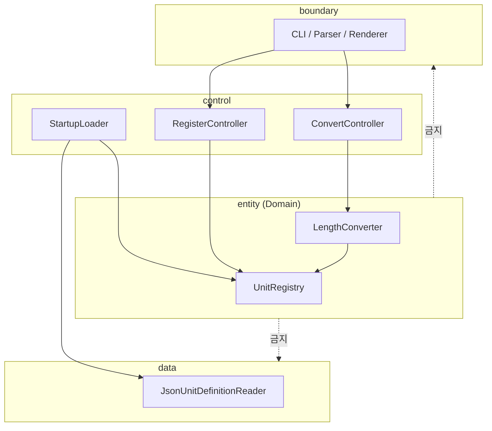

# UnitConverter_07

**meter 허브 기반 길이 단위 CLI 변환기** — C++17·클린 아키텍처·TDD 학습자를 위해, **계약·Catch2·BCE 레이어**로 확장 가능한 구조를 검증 가능하게 만드는 실습 프로젝트입니다.


---

## 목차

- [개요 (Overview)](#개요-overview)
- [빠른 시작 (Quick Start)](#빠른-시작-quick-start)
- [지원 단위 및 비율](#지원-단위-및-비율)
- [입력 형식 계약](#입력-형식-계약)
- [아키텍처](#아키텍처)
- [테스트 실행](#테스트-실행)
- [설정 파일 (JSON/YAML)](#설정-파일-jsonyaml)
- [출력 포맷](#출력-포맷)
- [기여 가이드 (Contributing)](#기여-가이드-contributing)
- [라이선스](#라이선스)

---

## 개요 (Overview)

### 이 프로젝트가 해결하는 문제

학습자는 `단위:값` 한 줄로 meter·feet·yard 변환을 기대하지만, 초기 코드에는 **비율 상수·단위 분기·파싱·stdout**이 한 흐름에 묶여 있습니다. 단위를 추가할 때마다 `if (unit == …)` 가 늘고, stderr·반올림·출력이 실행마다 달라지면 **잘못된 결과가 정상처럼** 보일 수 있습니다. 이 프로젝트는 “돌아가는 계산기”가 아니라 **golden 계약·커버리지·회귀 기준선**으로 완료를 판정하는 구조 학습을 목표로 합니다.

### 주요 학습 목표

| 원칙 | 학습 내용 |
|------|-----------|
| **SRP** | 파싱·검증·환산·직렬화·설정 로드를 분리 |
| **OCP** | 새 단위 = registry 등록; 새 포맷 = boundary renderer (Converter 분기 추가 금지) |
| **BCE** | boundary → control → entity (+ data); entity는 I/O·파일 의존 없음 |
| **TDD** | Catch2 RED → GREEN → REFACTOR; stderr/stdout **완전 일치** golden |

### PRD와의 연결

요구사항·입출력 계약·인수 기준의 **단일 정본(Source of Truth)** 은 [docs/PRD.md](./docs/PRD.md) 입니다. README는 실행·예시·기여 규칙을 담고, 계약 변경 시 **PRD → 테스트 → README** 순으로 갱신합니다.

### 실습 시간 (참고)

| 단계 | 시간 | 내용 |
|------|------|------|
| 분석 | 0.5h | 레거시 구조·계약 이해 |
| 기본·품질 | 2h | BCE·검증·OCP/SRP |
| TC | 0.5h | Catch2·golden |
| 추가 요구 | 2h | 설정·등록·포맷 |
| 회고 | 1h | TDD·AI 활용·리팩터 |

---

## 빠른 시작 (Quick Start)

### 사전 조건

| 항목 | 버전 |
|------|------|
| C++ 컴파일러 | **C++17** 이상 (GCC 8+, Clang 7+, MSVC 2017+) |
| CMake | **3.16+** (제출·CI 권장) |
| Catch2 | v2.x (FetchContent 또는 시스템 설치) |
| (선택) clang-format | `.cursorrules` 권장 |

### 빌드 & 실행 (CMake)

```bash
cmake -B build -DCMAKE_BUILD_TYPE=Debug
cmake --build build
./build/UnitConverter
```

테스트 포함 빌드·실행:

```bash
cmake -B build -DCMAKE_BUILD_TYPE=Debug
cmake --build build
ctest --test-dir build --output-on-failure
```

### 레거시 단일 파일 (로컬만)

초기 스켈레톤 확인용. **인수·CI는 CMake 타깃 기준.**

```bash
g++ -std=c++17 -o UnitConverter UnitConverter.cpp
./UnitConverter
```

### 예시 입출력

**입력 (stdin):**

```
meter:5.0
```

**출력 (table, 기본):**

```
5.0 meter = 5.0 meter
5.0 meter = 16.4 feet
5.0 meter = 5.5 yard
```

- 표시: **half-up, 소수 1자리** (boundary)
- Domain 산술: ε ≤ **1e-9** (feet 16.4042…, yard 5.46805…)

---

## 지원 단위 및 비율

모든 환산은 **meter 허브** (`metersPerUnit` = 1 meter당 미터 수) 기준입니다. feet↔yard **직접 상수 곱셈은 금지**합니다.

| 단위명 | 식별자 (입력) | meter 기준 비율 (`metersPerUnit`) | 출처 / 의미 |
|--------|---------------|-----------------------------------|-------------|
| meter | `meter` | 1.0 | 허브; 삭제·비율 변경 불가 |
| feet | `feet` | 3.28084 | 1 meter = 3.28084 feet |
| yard | `yard` | 1.09361 | 1 meter = 1.09361 yard |

**환산식:** `targetValue = sourceValue × (source.metersPerUnit / target.metersPerUnit)`

동적 등록·설정 파일로 위 표에 행을 **추가**할 수 있습니다 (Converter에 단위별 `if` 추가 금지).

---

## 입력 형식 계약

### 정상 입력 (convert)

| 예시 | 설명 |
|------|------|
| `meter:2.5` | 기본; table golden 3줄 (PRD §6.1) |
| `feet:3.28084` | 역환산; 출력 **좌변에 입력 보존** (PRES) |
| `yard:1.09361` | JSON 예시 입력 (PRD §6.2) |

- **형식:** `{unit}:{value}`
- **unit:** `[a-zA-Z][a-zA-Z0-9_]*`, registry 등록명과 **대소문자 일치**
- **value:** 0 이상; `0` 허용 (NEG-01)

### 동적 등록 (register)

```
1 cubit = 0.4572 meter
```

### 비정상 입력 (오류 패턴)

| 입력 예 | exit | stderr 패턴 (exact) |
|---------|------|---------------------|
| `meter2.5` (`:` 없음) | 1 | `Invalid format. Use unit:value (ex: meter:2.5)` |
| `meter:abc` (비숫자) | 1 | `Invalid number: abc` |
| `meter:-1` (음수, NEG-01) | 1 | `Value must be non-negative: -1` |
| `mile:1` (미등록) | 1 | `Unknown unit: mile` |

**공통:** 실패 시 stdout에 `{값} {단위} = …` 형태 줄 **0줄**.

### 음수 정책 (NEG-01)

- `value < 0` → 거절 (위 표)
- `value = 0` → 허용; 모든 target 표시 `0.0`

---

## 아키텍처

### BCE 레이어



### 의존성 방향

| From | To | 허용 |
|------|-----|------|
| boundary | control | ✓ |
| control | entity | ✓ |
| control | data (interface) | ✓ |
| entity | boundary, control, data | ✗ |
| data | entity 구현 | ✗ (DTO만) |

### 새 단위 추가 (코드 변경 최소화)

1. **설정:** `config/units.json` 의 `units[]`에 `{ "name", "metersPerUnit" }` 추가 **또는**
2. **런타임:** `1 {unit} = {ratio} meter` 등록 문장 입력
3. **검증:** Catch2로 `convert` 스냅샷에 신규 단위 포함 확인
4. **금지:** `LengthConverter`에 `if (unit == "새단위")` 분기 추가

새 **출력 포맷**은 boundary에 renderer 추가; **entity 수정 없음**.

### 디렉터리 (목표 구조)

```
entity/      # Registry, Converter
control/     # Use cases
boundary/    # CLI, Parser, Renderer
data/        # JSON reader
tests/       # Catch2 [entity][boundary][data][integration]
config/      # units.json
main.cpp     # wiring only
```

---

## 테스트 실행

### 프레임워크

**Catch2** — AAA(Arrange–Act–Assert), golden stderr/stdout **완전 일치**.

### 명령

```bash
cmake -B build -DCMAKE_BUILD_TYPE=Debug
cmake --build build
ctest --test-dir build --output-on-failure
```

태그 필터 예:

```bash
./build/unit_tests "[entity]"
./build/unit_tests "[boundary][parse]"
```

커버리지 (gcov/llvm-cov 등 도구 사용 시):

```bash
cmake -B build -DCMAKE_BUILD_TYPE=Debug -DCMAKE_CXX_FLAGS="--coverage"
cmake --build build
ctest --test-dir build
# 이후 lcov/llvm-cov로 리포트 생성
```

### 커버리지 목표 (PRD §4.3)

| 레이어 | Line | Branch |
|--------|------|--------|
| entity | ≥ 95% | ≥ 90% |
| boundary | ≥ 90% | ≥ 85% |
| data | ≥ 85% | ≥ 80% |
| control | ≥ 80% | ≥ 75% |

### 회귀 (요약)

- 허브 환산 기준선(D-TC) 실패 시 merge 금지
- golden·에러 문구 변경 시 **테스트·PRD·README** 동시 갱신
- 상세: [docs/PRD.md §7.2](./docs/PRD.md)

---

## 설정 파일 (JSON/YAML)

### 위치

기본 경로: `config/units.json` (앱 시작 시 로드)

### JSON 형식

```json
{
  "hub": "meter",
  "units": [
    { "name": "meter", "metersPerUnit": 1.0 },
    { "name": "feet", "metersPerUnit": 3.28084 },
    { "name": "yard", "metersPerUnit": 1.09361 }
  ]
}
```

### 로드 실패 (exit 2)

| 조건 | stderr (exact) |
|------|----------------|
| 파일 없음 | `Failed to load config: {path}` |
| ratio ≤ 0 | `Invalid config: non-positive ratio for unit {unit}` |
| name 중복 | `Invalid config: duplicate unit name {unit}` |

### YAML (선택)

JSON과 **동일 의미** (`hub`, `units[]`). PRD FR-11.

### 동적 단위 등록 (런타임)

**입력:**

```
1 cubit = 0.4572 meter
```

**검증 예:** 이후 `cubit:1` → meter `0.4572` (ε ≤ 1e-9)

| 실패 | stderr (exact) |
|------|----------------|
| 형식 오류 | `Invalid register format. Use 1 unit = ratio meter (ex: 1 cubit = 0.4572 meter)` |
| 중복 | `Unit already registered: cubit` |
| ratio ≤ 0 | `Ratio must be positive: {ratio}` |

---

## 출력 포맷

공통: **PRES** — table 좌변·JSON `source`는 **사용자 입력 unit/value 보존**.  
표시값만 **half-up, 소수 1자리**. table / json / csv **수치 집합 동일** (FMT-01).

### 콘솔 (table, 기본)

```
2.5 meter = 2.5 meter
2.5 meter = 8.2 feet
2.5 meter = 2.7 yard
```

### JSON (`--format=json`)

입력: `yard:1.09361`

```json
{
  "source": { "unit": "yard", "value": 1.09361 },
  "conversions": [
    { "unit": "meter", "value": 1.0 },
    { "unit": "feet", "value": 3.3 },
    { "unit": "yard", "value": 1.1 }
  ]
}
```

- `source.value`: 파싱값, **반올림 없음**
- `conversions.length`: 등록 단위 수

### CSV (`--format=csv`)

입력: `meter:2.5` (3단위 가정)

```csv
source_unit,source_value,target_unit,target_value
meter,2.5,meter,2.5
meter,2.5,feet,8.2
meter,2.5,yard,2.7
```

- 헤더 줄 **exact** 고정
- 모든 데이터 행의 `source_unit`, `source_value` 동일

### 잘못된 포맷 옵션 (선택 FR-10)

```
Invalid format option. Use table, json, or csv
```

exit `1`

---

## 기여 가이드 (Contributing)

### 계약 변경 금지 원칙

- stderr/stdout **문자열·exit code** 는 [docs/PRD.md §3.2](./docs/PRD.md) 와 golden 테스트가 정본
- “문구만 살짝” 수정 → **계약 변경** → PRD §7 REG-02 위반
- 비율 변경은 `config/units.json` 또는 named constexpr만; 산재 literal 금지

### 테스트 없는 PR 거부

- 프로덕션 로직 변경 PR에는 **실패했던 RED 또는 동등 TC** 필수
- 테스트 삭제·완화·`@skip` 으로 GREEN 만들기 **금지**
- entity에 `iostream` / 전역 mutable registry **금지** (`.cursorrules` forbidden)

### 커밋 메시지 컨벤션

```
<type>(<scope>): <subject>

<body: what contract / test ID>
```

| type | 용도 |
|------|------|
| `test` | RED 또는 golden 추가 |
| `feat` | FR-ID 단위 GREEN |
| `refactor` | 동작 동일, 구조만 (전 테스트 PASS 후) |
| `docs` | PRD/README 동기화 |

**scope 예:** `entity`, `boundary`, `control`, `data`, `contract`

### PR 체크리스트

- [ ] `ctest` 전체 PASS
- [ ] 계약 변경 시 PRD + golden + README 동시 수정
- [ ] 커버리지 임계치 미달 없음 (해당 레이어 touch 시)
- [ ] clang-format 적용

---

## 라이선스

**MIT License** — 학습·실습·포크 자유. 상업 사용 시 표준 MIT 고지 유지.

---

*계약·인수 기준 상세: [docs/PRD.md](./docs/PRD.md) · 코딩 규칙: [.cursorrules](./.cursorrules)*
